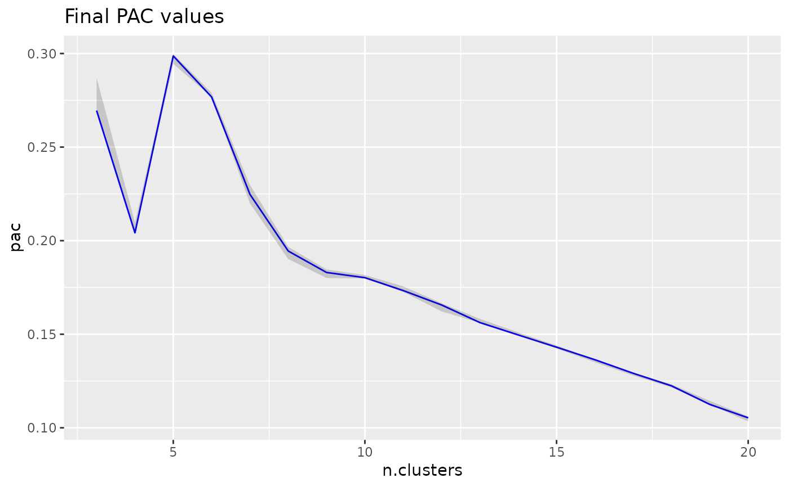
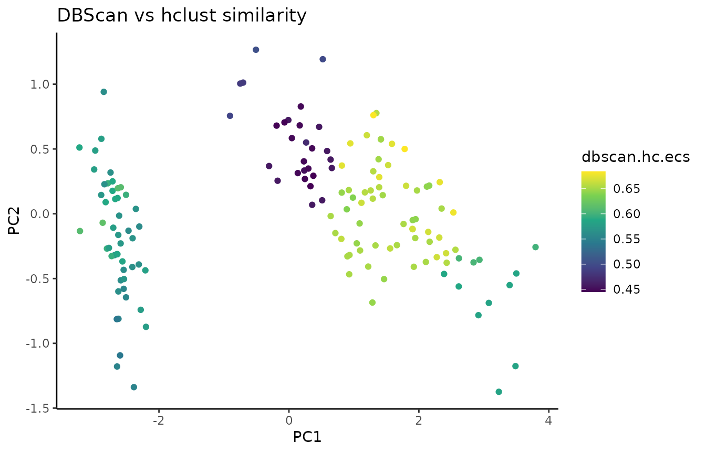

# ClustAssess: a Set of Tools for Assessing Clustering
This repo contains the ClustAssess R package, which provides a set of tools
for assessing clustering robustness.

- [The Tools](#the-tools)
  * [Proportion of Ambiguously Clustered Pairs (PAC)](#proportion-of-ambiguously-clustered-pairs-pac)
  * [Element Centric Clustering Similarity (ECS)](#element-centric-clustering-similarity-ecs)
  * [Marker gene overlap](#marker-gene-overlap)
- [Installation](#installation)
- [References](#references)

# The Tools
## Proportion of Ambiguously Clustered Pairs (PAC)
To assess clustering robustness, the proportion of ambiguously clustered pairs
(PAC) [1] uses a consensus clustering. The rate of element co-clustering is
recorded across various numbers of clusters, *k*. The lower the PAC, the stabler
the clustering for that *k*.

ClustAssess uses a heirarchical clustering as base for the consensus clustering,
and an optimized Rcpp [2] implementation to calculate the PAC values. To
calculate PAC, we write:

`cc_res = consensus_cluster(your_data, n_reps=50, k_max=20, p_sample=0.8, p_feature=0.8)`

It is important that the PAC has converged before using it to assess your data;
the `pac_convergence` function can be used to visualize the PAC curves across
iterations:

As the curves have evened out, we surmize that PAC has converged in this case.
If the PAC has not converged, increase the `n_reps` value.

If the dataset contains >1000 elements, we recommend calculating a geometric
sketch [3] of your data of size <1000, and running PAC on that sketch.

A local minimum in the PAC landscape, as visualized below using the
`pac_landscape` function, can be interpreted as an optimal *k* for the dataset:

## Element Centric Clustering Similarity (ECS)
Element-centric similarity (ECS) [4] is a per-observation measure of clustering
similarity. Briefly, ECS is obtained by constructing a cluster-induced element
graph, and subsequently calculating the stationary probability distribution of
a random walk with restarts (also known as a personalized Pagerank) over the
elements.

In addition to providing per-element information on clustering agreement, ECS
avoids several pitfalls associated with other measures of clustering
similarity (refer to [4] for more detail).

To calculate ECS, the user first needs to create a `Clustering` object:

`clustering_object1 = create_clustering(clustering_result1, alpha=0.9)`

where `1-alpha` is the restart probability of the random walk. To compare two
clusterings, we use the `element_sim_elscore` function:

`ecs = element_sim_elscore(clustering_object1, clustering_object2)`

and we can subsequently visualize the ECS on a PCA of the data:

In addition to flat disjoint clusterings (like the result of k-means for
example), ClustAssess can also compare overlapping clusterings and hierarchical
clusterings; refer to the `create_clustering` documentation for more detail.

Besides comparing two clusterings with `element_sim_elscore`, ClustAssess
also enables computing the per-element consistency (aka frustration) between a
set of clusterings with the `element_frustration` function, and comparing a set
of clusterings with a ground truth partitioning of elements with the
`element_agreement` function.

## Marker Gene Overlap
In the analysis of single-cell RNA-seq data, cluster marker genes are typically
used to infer the cell type of clusters. However, two different clustering
results may lead to two different sets of markers for the cells. The
`marker_overlap` function allows the comparison of two sets of markers. The
output can be either as the number of common marker genes per cell, or as
Jaccard similarity (size of intersect divided by size of union) per cell.

# Installation
The following packages are required for ClustAssess:
* ggplot2
* dplyr
* fastcluster
* rlang
* Matrix
* igraph
* magrittr
* Rcpp
* methods
* stats

To run all examples and vignettes, the following packages are also needed:
* knitr
* rmarkdown
* e1071
* dbscan
* dendextend
* Seurat

# References
[1] Șenbabaoğlu, Y., Michailidis, G., & Li, J. Z. (2014).
Critical limitations of consensus clustering in class discovery.
Scientific reports, 4(1), 1-13. https://doi.org/10.1038/srep06207

[2] Eddelbuettel, D., & Balamuta, J. J. (2018). Extending R with C++: A brief
introduction to Rcpp. The American Statistician, 72(1), 28-36.
https://doi.org/10.1080/00031305.2017.1375990

[3] Hie, B., Cho, H., DeMeo, B., Bryson, B., & Berger, B. (2019). Geometric
sketching compactly summarizes the single-cell transcriptomic landscape. Cell
systems, 8(6), 483-493. https://doi.org/10.1016/j.cels.2019.05.003

[4] Gates, A. J., Wood, I. B., Hetrick, W. P., & Ahn, Y. Y. (2019).
Element-centric clustering comparison unifies overlaps and hierarchy.
Scientific reports, 9(1), 1-13. https://doi.org/10.1038/s41598-019-44892-y
