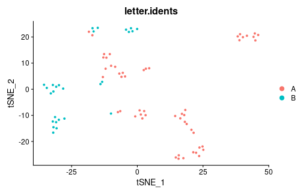
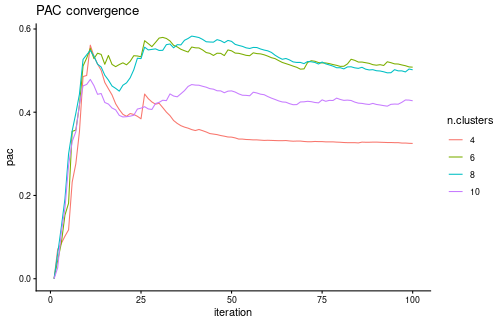
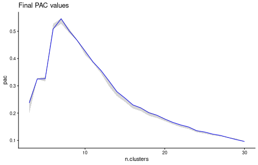
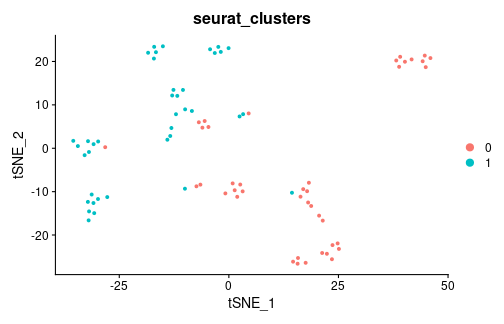
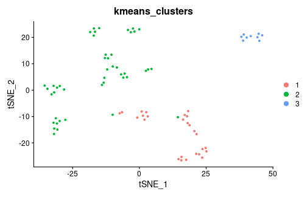
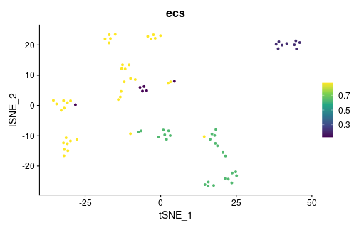
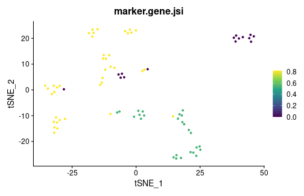

# Evaluating single-cell clustering with ClustAssess

In this vignette we will illustrate several of the tools available in
ClustAssess on a small single-cell RNA-seq dataset.

``` r

library(Seurat)
library(ClustAssess)
library(ggplot2)
theme_set(theme_classic())

data("pbmc_small")

# we will use the pbmc_small single-cell RNA-seq dataset available via Seurat
DimPlot(pbmc_small, group.by = "letter.idents")
```



plot of chunk setup

## Proportion of ambiguously clustered pairs

The proportion of ambiguously clustered pairs (PAC) uses consensus
clustering to infer the optimal number of clusters for the data, by
observing how variably pairs of elements cluster together. The lower the
PAC, the more stable the clustering. PAC was originally presented in
<https://doi.org/10.1038/srep06207>.

``` r
# retrieve scaled data for PAC calculation
pbmc.data <- GetAssayData(pbmc_small, assay = "RNA", layer = "scale.data")

# perform consensus clustering
cc.res <- consensus_cluster(t(pbmc.data),
    k_max = 30,
    n_reps = 100,
    p_sample = 0.8,
    p_feature = 0.8,
    verbose = TRUE
)
#> Calculating consensus clustering
#> 
[================>------------------------] 41/100 eta:  0s  total elapsed:   0s
[================>------------------------] 42/100 eta:  0s  total elapsed:   0s
[=================>-----------------------] 43/100 eta:  0s  total elapsed:   0s
[=================>-----------------------] 44/100 eta:  0s  total elapsed:   0s
[=================>-----------------------] 45/100 eta:  0s  total elapsed:   0s
[==================>----------------------] 46/100 eta:  0s  total elapsed:   0s
[==================>----------------------] 47/100 eta:  0s  total elapsed:   0s
[===================>---------------------] 48/100 eta:  0s  total elapsed:   0s
[===================>---------------------] 49/100 eta:  0s  total elapsed:   0s
[===================>---------------------] 50/100 eta:  0s  total elapsed:   0s
[====================>--------------------] 51/100 eta:  0s  total elapsed:   0s
[====================>--------------------] 52/100 eta:  0s  total elapsed:   0s
[=====================>-------------------] 53/100 eta:  0s  total elapsed:   0s
[=====================>-------------------] 54/100 eta:  0s  total elapsed:   0s
[======================>------------------] 55/100 eta:  0s  total elapsed:   0s
[======================>------------------] 56/100 eta:  0s  total elapsed:   0s
[======================>------------------] 57/100 eta:  0s  total elapsed:   0s
[=======================>-----------------] 58/100 eta:  0s  total elapsed:   0s
[=======================>-----------------] 59/100 eta:  0s  total elapsed:   0s
[========================>----------------] 60/100 eta:  0s  total elapsed:   0s
[========================>----------------] 61/100 eta:  0s  total elapsed:   0s
[========================>----------------] 62/100 eta:  0s  total elapsed:   0s
[=========================>---------------] 63/100 eta:  0s  total elapsed:   0s
[=========================>---------------] 64/100 eta:  0s  total elapsed:   0s
[==========================>--------------] 65/100 eta:  0s  total elapsed:   0s
[==========================>--------------] 66/100 eta:  0s  total elapsed:   0s
[==========================>--------------] 67/100 eta:  0s  total elapsed:   0s
[===========================>-------------] 68/100 eta:  0s  total elapsed:   0s
[===========================>-------------] 69/100 eta:  0s  total elapsed:   0s
[============================>------------] 70/100 eta:  0s  total elapsed:   0s
[============================>------------] 71/100 eta:  0s  total elapsed:   0s
[=============================>-----------] 72/100 eta:  0s  total elapsed:   0s
[=============================>-----------] 73/100 eta:  0s  total elapsed:   0s
[=============================>-----------] 74/100 eta:  0s  total elapsed:   0s
[==============================>----------] 75/100 eta:  0s  total elapsed:   0s
[==============================>----------] 76/100 eta:  0s  total elapsed:   0s
[===============================>---------] 77/100 eta:  0s  total elapsed:   0s
[===============================>---------] 78/100 eta:  0s  total elapsed:   0s
[===============================>---------] 79/100 eta:  0s  total elapsed:   0s
[================================>--------] 80/100 eta:  0s  total elapsed:   0s
[================================>--------] 81/100 eta:  0s  total elapsed:   0s
[=================================>-------] 82/100 eta:  0s  total elapsed:   0s
[=================================>-------] 83/100 eta:  0s  total elapsed:   0s
[=================================>-------] 84/100 eta:  0s  total elapsed:   0s
[==================================>------] 85/100 eta:  0s  total elapsed:   0s
[==================================>------] 86/100 eta:  0s  total elapsed:   0s
[===================================>-----] 87/100 eta:  0s  total elapsed:   0s
[===================================>-----] 88/100 eta:  0s  total elapsed:   0s
[===================================>-----] 89/100 eta:  0s  total elapsed:   0s
[====================================>----] 90/100 eta:  0s  total elapsed:   0s
[====================================>----] 91/100 eta:  0s  total elapsed:   0s
[=====================================>---] 92/100 eta:  0s  total elapsed:   0s
[=====================================>---] 93/100 eta:  0s  total elapsed:   0s
[======================================>--] 94/100 eta:  0s  total elapsed:   0s
[======================================>--] 95/100 eta:  0s  total elapsed:   0s
[======================================>--] 96/100 eta:  0s  total elapsed:   1s
[=======================================>-] 97/100 eta:  0s  total elapsed:   1s
[=======================================>-] 98/100 eta:  0s  total elapsed:   1s
[========================================>] 99/100 eta:  0s  total elapsed:   1s
[========================================] 100/100 eta:  0s  total elapsed:   1s

# assess the PAC convergence for a few values of k - each curve should
# have converged to some value
k.plot <- c(4, 6, 8, 10)
pac_convergence(cc.res, k.plot)
```



plot of chunk pac

``` r


# visualize the final PAC across k - there seems to be a local maximum at k=7,
# indicating that 7 clusters leads to a less stable clustering of the data than
# nearby values of k
pac_landscape(cc.res)
```



plot of chunk pac

## Element-centric clustering comparison

We compare the similarity of clustering results between methods (in this
case, between Louvain community detection and k-means) using
Element-Centric Similarity (ECS), which quantifies the clustering
similarity per cell. Higher ECS indicates that an observation is
clustered similarly across methods. ECS was introduced in
<https://doi.org/10.1038/s41598-019-44892-y>.

``` r

# first, cluster with Louvain algorithm
pbmc_small <- FindClusters(pbmc_small, resolution = 0.8, verbose = FALSE)
DimPlot(pbmc_small, group.by = "seurat_clusters")
```



plot of chunk ecs

``` r


# also cluster with PCA+k-means
pbmc_pca <- Embeddings(pbmc_small, "pca")
pbmc_small@meta.data$kmeans_clusters <- kmeans(pbmc_pca,
    centers = 3,
    nstart = 10,
    iter.max = 1e3
)$cluster
DimPlot(pbmc_small, group.by = "kmeans_clusters")
```



plot of chunk ecs

``` r


# where are the clustering results more similar?
pbmc_small@meta.data$ecs <- element_sim_elscore(
    pbmc_small@meta.data$seurat_clusters,
    pbmc_small@meta.data$kmeans_clusters
)
suppressMessages(FeaturePlot(pbmc_small, "ecs") + scale_colour_viridis_c())
```



plot of chunk ecs

``` r

mean(pbmc_small@meta.data$ecs)
#> [1] 0.6632927
```

## Jaccard similarity of cluster markers

As a common step in computational single-cell RNA-seq analyses,
discriminative marker genes are identified for each cluster. These
markers are then used to infer the cell type of the respective cluster.
Here, we compare the markers obtained for each clustering method to ask:
how similarly would each cell be interpreted across clustering methods?
We compare the markers per cell using the Jaccard similarity (defined as
the size of the intersect divided by the size of the overlap) of the
marker gene lists. The higher the JSI, the more similar are the marker
genes for that cell.

``` r

# first, we calculate the markers on the Louvain clustering
Idents(pbmc_small) <- pbmc_small@meta.data$seurat_clusters
louvain.markers <- FindAllMarkers(pbmc_small,
    logfc.threshold = 1,
    min.pct = 0.0,
    test.use = "roc",
    verbose = FALSE
)

# then we get the markers on the k-means clustering
Idents(pbmc_small) <- pbmc_small@meta.data$kmeans_clusters
kmeans.markers <- FindAllMarkers(pbmc_small,
    logfc.threshold = 1,
    min.pct = 0.0,
    test.use = "roc",
    verbose = FALSE
)

# next, compare the top 10 markers per cell
pbmc_small@meta.data$marker.gene.jsi <- marker_overlap(louvain.markers,
    kmeans.markers,
    pbmc_small@meta.data$seurat_clusters,
    pbmc_small@meta.data$kmeans_clusters,
    n = 10,
    rank_by = "power"
)

# which cells have the same markers, regardless of clustering?
suppressMessages(FeaturePlot(pbmc_small, "marker.gene.jsi") + scale_colour_viridis_c())
```



plot of chunk jsi

``` r

mean(pbmc_small@meta.data$marker.gene.jsi)
#> [1] 0.5738636
```

## Element-wise consistency

How consistently are cells clustered by k-means? We will rerun k-means
clustering 20 times to investigate.

``` r

clustering.list <- list()
n.reps <- 20
for (i in 1:n.reps) {
    # we set nstart=1 and a fairly high iter.max - this should mean that
    # the algorithm converges, and that the variability in final clusterings
    # depends mainly on the random initial cluster assignments
    km.res <- kmeans(pbmc_pca, centers = 3, nstart = 1, iter.max = 1e3)$cluster
    clustering.list[[i]] <- km.res
}

# now, we calculate the element-wise consistency (aka frustration), which
# performs pair-wise comparisons between all 20 clusterings; the
# consistency is the average per-cell ECS across all comparisons. The higher
# the consistency, the more consistently is that cell clustered across
# random seeds.
pbmc_small@meta.data$consistency <- element_consistency(clustering.list)

# which cells are clustered more consistently?
suppressMessages(FeaturePlot(pbmc_small, "consistency") + scale_colour_viridis_c())
```


plot of chunk frust

``` r

mean(pbmc_small@meta.data$consistency)
#> [1] 0.6712922
```

## Session info

``` r

sessionInfo()
#> R version 4.4.0 (2024-04-24)
#> Platform: x86_64-pc-linux-gnu
#> Running under: Ubuntu 22.04.5 LTS
#> 
#> Matrix products: default
#> BLAS:   /usr/lib/x86_64-linux-gnu/openblas-pthread/libblas.so.3 
#> LAPACK: /usr/lib/x86_64-linux-gnu/openblas-pthread/libopenblasp-r0.3.20.so;  LAPACK version 3.10.0
#> 
#> locale:
#>  [1] LC_CTYPE=C.UTF-8       LC_NUMERIC=C           LC_TIME=C.UTF-8        LC_COLLATE=C.UTF-8     LC_MONETARY=C.UTF-8    LC_MESSAGES=C.UTF-8    LC_PAPER=C.UTF-8       LC_NAME=C              LC_ADDRESS=C           LC_TELEPHONE=C         LC_MEASUREMENT=C.UTF-8 LC_IDENTIFICATION=C   
#> 
#> time zone: Europe/Bucharest
#> tzcode source: system (glibc)
#> 
#> attached base packages:
#> [1] stats     graphics  grDevices utils     datasets  methods   base     
#> 
#> other attached packages:
#> [1] ggplot2_4.0.3      ClustAssess_1.2.0  Seurat_5.1.0       SeuratObject_5.0.2 sp_2.1-4          
#> 
#> loaded via a namespace (and not attached):
#>   [1] deldir_2.0-4           pbapply_1.7-2          gridExtra_2.3          rlang_1.3.0            magrittr_2.0.3         RcppAnnoy_0.0.22       otel_0.2.0             matrixStats_1.3.0      ggridges_0.5.6         compiler_4.4.0         spatstat.geom_3.2-9    png_0.1-8              vctrs_0.6.5           
#>  [14] reshape2_1.4.4         stringr_1.5.1          crayon_1.5.3           pkgconfig_2.0.3        fastmap_1.2.0          labeling_0.4.3         utf8_1.2.4             promises_1.3.0         purrr_1.0.2            xfun_0.56              jsonlite_2.0.0         progress_1.2.3         goftest_1.2-3         
#>  [27] later_1.3.2            spatstat.utils_3.1-2   prettyunits_1.2.0      irlba_2.3.5.1          parallel_4.4.0         cluster_2.1.6          R6_2.6.1               ica_1.0-3              stringi_1.8.4          RColorBrewer_1.1-3     spatstat.data_3.0-4    reticulate_1.37.0      parallelly_1.37.1     
#>  [40] lmtest_0.9-40          scattermore_1.2        iterators_1.0.14       Rcpp_1.0.13            knitr_1.51             tensor_1.5             future.apply_1.11.2    zoo_1.8-12             sctransform_0.4.1      httpuv_1.6.15          Matrix_1.7-0           splines_4.4.0          igraph_2.2.1          
#>  [53] tidyselect_1.2.1       abind_1.4-5            spatstat.random_3.2-3  codetools_0.2-19       miniUI_0.1.2           spatstat.explore_3.2-7 listenv_0.9.1          lattice_0.22-5         tibble_3.2.1           plyr_1.8.9             withr_3.0.3            shiny_1.8.1.1          S7_0.2.1              
#>  [66] ROCR_1.0-11            evaluate_1.0.5         Rtsne_0.17             future_1.33.2          fastDummies_1.7.3      survival_3.5-8         polyclip_1.10-6        fitdistrplus_1.1-11    pillar_1.9.0           KernSmooth_2.23-22     foreach_1.5.2          plotly_4.10.4          generics_0.1.3        
#>  [79] RcppHNSW_0.6.0         hms_1.1.3              scales_1.4.0           globals_0.16.3         xtable_1.8-4           glue_1.7.0             lazyeval_0.2.2         tools_4.4.0            data.table_1.15.4      RSpectra_0.16-2        RANN_2.6.1             fastcluster_1.2.6      leiden_0.4.3.1        
#>  [92] dotCall64_1.1-1        cowplot_1.1.3          grid_4.4.0             tidyr_1.3.1            colorspace_2.1-1       nlme_3.1-163           patchwork_1.2.0        cli_3.6.6              spatstat.sparse_3.0-3  spam_2.10-0            fansi_1.0.6            viridisLite_0.4.2      dplyr_1.1.4           
#> [105] uwot_0.2.2             gtable_0.3.6           digest_0.6.35          progressr_0.14.0       ggrepel_0.9.5          htmlwidgets_1.6.4      farver_2.1.2           htmltools_0.5.8.1      lifecycle_1.0.5        httr_1.4.7             mime_0.12              MASS_7.3-60
```
