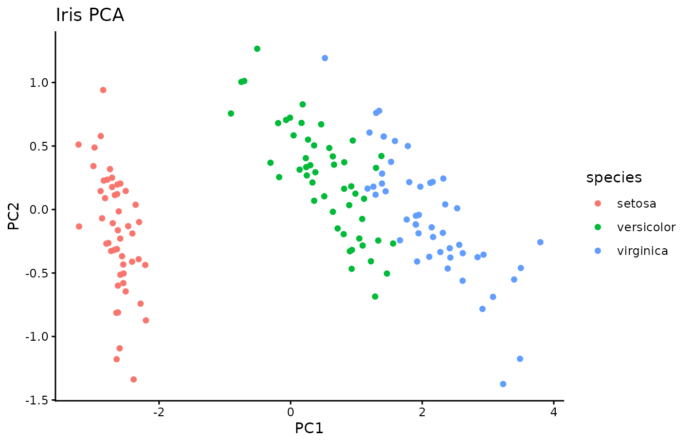
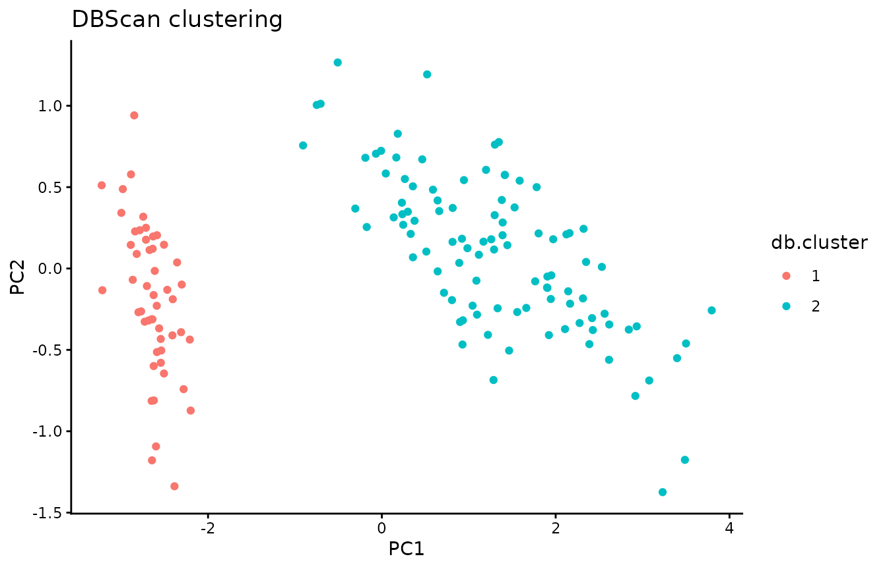
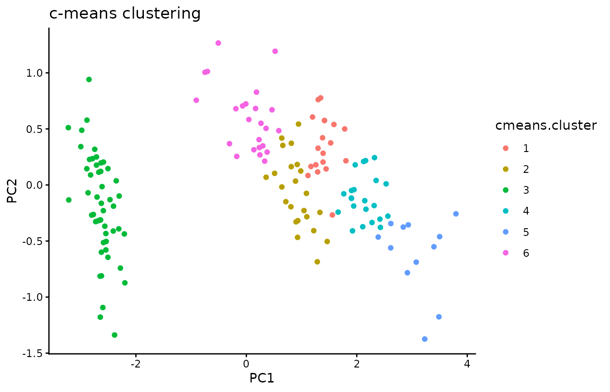
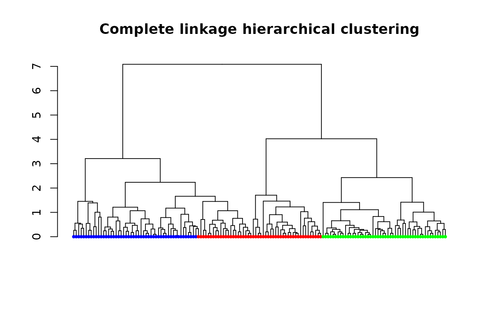
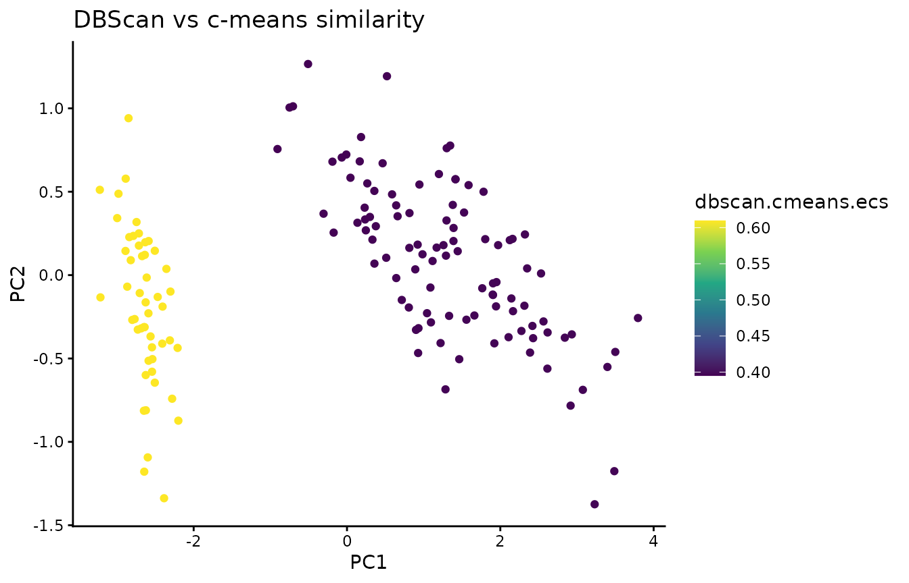
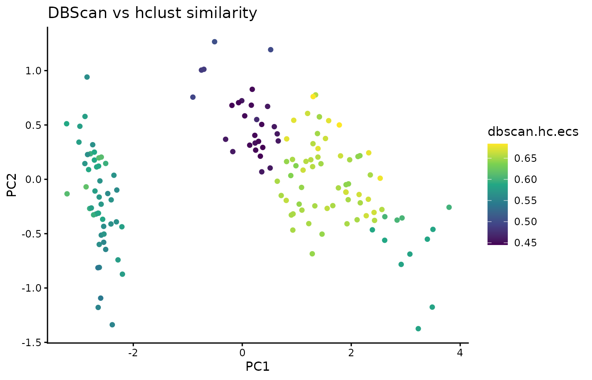
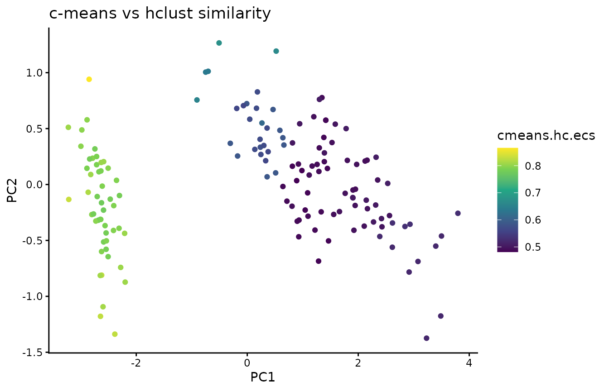

# Comparing soft and hierarchical clusterings with element-centric similarity

``` r

is_e1071 <- require("e1071", quietly = TRUE)
if (!is_e1071) {
    install.packages("e1071", repos = "https://cloud.r-project.org")
    library(e1071)
}
#> Installing package into '/home/runner/work/_temp/Library'
#> (as 'lib' is unspecified)
#> also installing the dependency 'proxy'

is_dbscan <- require("dbscan", quietly = TRUE)
if (!is_dbscan) {
    install.packages("dbscan", repos = "https://cloud.r-project.org")
    library(dbscan)
}
#> Installing package into '/home/runner/work/_temp/Library'
#> (as 'lib' is unspecified)
#> 
#> Attaching package: 'dbscan'
#> The following object is masked from 'package:stats':
#> 
#>     as.dendrogram

is_dendextend <- require("dendextend", quietly = TRUE)
if (!is_dendextend) {
    install.packages("dendextend", repos = "https://cloud.r-project.org")
    library(dendextend)
}
#> Installing package into '/home/runner/work/_temp/Library'
#> (as 'lib' is unspecified)
#> also installing the dependency 'viridis'
#> 
#> ---------------------
#> Welcome to dendextend version 1.19.1
#> Type citation('dendextend') for how to cite the package.
#> 
#> Type browseVignettes(package = 'dendextend') for the package vignette.
#> The github page is: https://github.com/talgalili/dendextend/
#> 
#> Suggestions and bug-reports can be submitted at: https://github.com/talgalili/dendextend/issues
#> You may ask questions at stackoverflow, use the r and dendextend tags: 
#>   https://stackoverflow.com/questions/tagged/dendextend
#> 
#>  To suppress this message use:  suppressPackageStartupMessages(library(dendextend))
#> ---------------------
#> 
#> Attaching package: 'dendextend'
#> The following object is masked from 'package:stats':
#> 
#>     cutree

install.packages("harmony", repos = "https://cloud.r-project.org")
#> Installing package into '/home/runner/work/_temp/Library'
#> (as 'lib' is unspecified)
#> also installing the dependencies 'RcppArmadillo', 'RcppProgress'
```

In this vignette we will illustrate how element-centric similarity can
be used to compare different kinds of clustering results: flat disjoint
clusterings, flat overlapping clusterings, and hierarchical clusterings.

``` r

library(ClustAssess)
library(ggplot2)
#> 
#> Attaching package: 'ggplot2'
#> The following object is masked from 'package:e1071':
#> 
#>     element
suppressPackageStartupMessages(library(dendextend))
theme_set(theme_classic())

# we will use the Iris dataset for this vignette
data <- as.matrix(iris[, 1:4])
df.iris <- as.data.frame(prcomp(data)$x)
df.iris$species <- iris$Species
ggplot(df.iris, aes(x = PC1, y = PC2, color = species)) +
    geom_point() +
    labs(title = "Iris PCA")
```



Next, we cluster the data using three different approaches.

``` r

# a flat, disjoint clustering with DBscan
db.res <- dbscan(data, eps = 1)$cluster
df.iris$db.cluster <- as.factor(db.res)
ggplot(df.iris, aes(x = PC1, y = PC2, color = db.cluster)) +
    geom_point() +
    labs(title = "DBScan clustering")
```



``` r


# an overlapping clustering with soft k-means
cmeans.res <- cmeans(data, centers = 6)$membership
# get the strongest cluster assignment for each observation to plot
# but we will still use the soft cluster assignments to calculate ECS
df.iris$cmeans.cluster <- as.factor(apply(cmeans.res, 1, which.max))
ggplot(df.iris, aes(x = PC1, y = PC2, color = cmeans.cluster)) +
    geom_point() +
    labs(title = "c-means clustering")
```



``` r


# a hierarchical clustering
distances <- dist(data, method = "euclidean")
hc.res <- hclust(distances, method = "complete")
# plot the resulting dendrogram
node.colors <- c("blue", "red", "green")
hc.res %>%
    as.dendrogram() %>%
    set("leaves_pch", 19) %>%
    set("leaves_cex", 0.5) %>%
    set("leaves_col", node.colors[df.iris$species]) %>%
    plot(main = "Complete linkage hierarchical clustering", leaflab = "none")
```



Now, we will compare the clustering results using element-centric
similarity. ECS allows us to compare different kinds of clustering
results, including the overlapping clustering and the hierarchical
clustering we just calculated. The results tell us how similarly each
observation was clustered by the two methods; the higher the ECS, the
more similar the clustering of that observation.

``` r

# which observations are clustered more similarly?
# first compare flat disjoint and flat soft clusterings
df.iris$dbscan.cmeans.ecs <- element_sim_elscore(
    db.res,
    cmeans.res
)
ggplot(df.iris, aes(x = PC1, y = PC2, color = dbscan.cmeans.ecs)) +
    geom_point() +
    labs(title = "DBScan vs c-means similarity") +
    scale_colour_viridis_c()
```



``` r

mean(df.iris$dbscan.cmeans.ecs)
#> [1] 0.4675256

# next compare flat disjoint and hierarchical disjoint clusterings
df.iris$dbscan.hc.ecs <- element_sim_elscore(
    db.res,
    hc.res
)
ggplot(df.iris, aes(x = PC1, y = PC2, color = dbscan.hc.ecs)) +
    geom_point() +
    labs(title = "DBScan vs hclust similarity") +
    scale_colour_viridis_c()
```



``` r

mean(df.iris$dbscan.hc.ecs)
#> [1] 0.5875193

# finally compare flat soft and hierarchical disjoint clusterings
df.iris$cmeans.hc.ecs <- element_sim_elscore(
    cmeans.res,
    hc.res
)
ggplot(df.iris, aes(x = PC1, y = PC2, color = cmeans.hc.ecs)) +
    geom_point() +
    labs(title = "c-means vs hclust similarity") +
    scale_colour_viridis_c()
```



``` r

mean(df.iris$cmeans.hc.ecs)
#> [1] 0.614915
```

## Session info

``` r

sessionInfo()
#> R version 4.4.3 (2025-02-28)
#> Platform: x86_64-pc-linux-gnu
#> Running under: Ubuntu 24.04.4 LTS
#> 
#> Matrix products: default
#> BLAS:   /usr/lib/x86_64-linux-gnu/openblas-pthread/libblas.so.3 
#> LAPACK: /usr/lib/x86_64-linux-gnu/openblas-pthread/libopenblasp-r0.3.26.so;  LAPACK version 3.12.0
#> 
#> locale:
#>  [1] LC_CTYPE=C.UTF-8       LC_NUMERIC=C           LC_TIME=C.UTF-8       
#>  [4] LC_COLLATE=C.UTF-8     LC_MONETARY=C.UTF-8    LC_MESSAGES=C.UTF-8   
#>  [7] LC_PAPER=C.UTF-8       LC_NAME=C              LC_ADDRESS=C          
#> [10] LC_TELEPHONE=C         LC_MEASUREMENT=C.UTF-8 LC_IDENTIFICATION=C   
#> 
#> time zone: UTC
#> tzcode source: system (glibc)
#> 
#> attached base packages:
#> [1] stats     graphics  grDevices utils     datasets  methods   base     
#> 
#> other attached packages:
#> [1] ggplot2_4.0.3     ClustAssess_1.2.0 dendextend_1.19.1 dbscan_1.2.6     
#> [5] e1071_1.7-17     
#> 
#> loaded via a namespace (and not attached):
#>  [1] viridis_0.6.5      sass_0.4.10        generics_0.1.4     class_7.3-23      
#>  [5] lattice_0.22-6     digest_0.6.39      magrittr_2.0.5     evaluate_1.0.5    
#>  [9] grid_4.4.3         RColorBrewer_1.1-3 iterators_1.0.14   fastmap_1.2.0     
#> [13] foreach_1.5.2      jsonlite_2.0.0     Matrix_1.7-2       gridExtra_2.3.1   
#> [17] viridisLite_0.4.3  scales_1.4.0       codetools_0.2-20   textshaping_1.0.5 
#> [21] jquerylib_0.1.4    cli_3.6.6          rlang_1.3.0        withr_3.0.3       
#> [25] cachem_1.1.0       yaml_2.3.12        otel_0.2.0         tools_4.4.3       
#> [29] dplyr_1.2.1        vctrs_0.7.3        R6_2.6.1           proxy_0.4-29      
#> [33] lifecycle_1.0.5    fs_2.1.0           htmlwidgets_1.6.4  ragg_1.5.2        
#> [37] pkgconfig_2.0.3    desc_1.4.3         pkgdown_2.2.1      pillar_1.11.1     
#> [41] bslib_0.12.0       gtable_0.3.6       glue_1.8.1         Rcpp_1.1.2        
#> [45] systemfonts_1.3.2  xfun_0.60          tibble_3.3.1       tidyselect_1.2.1  
#> [49] knitr_1.51         farver_2.1.2       igraph_2.3.3       htmltools_0.5.9   
#> [53] labeling_0.4.3     rmarkdown_2.31     compiler_4.4.3     S7_0.2.2
```
