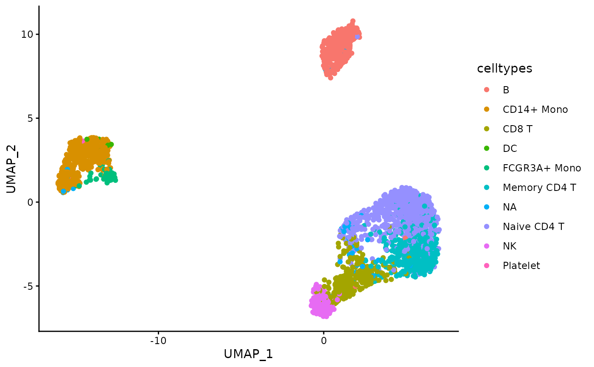
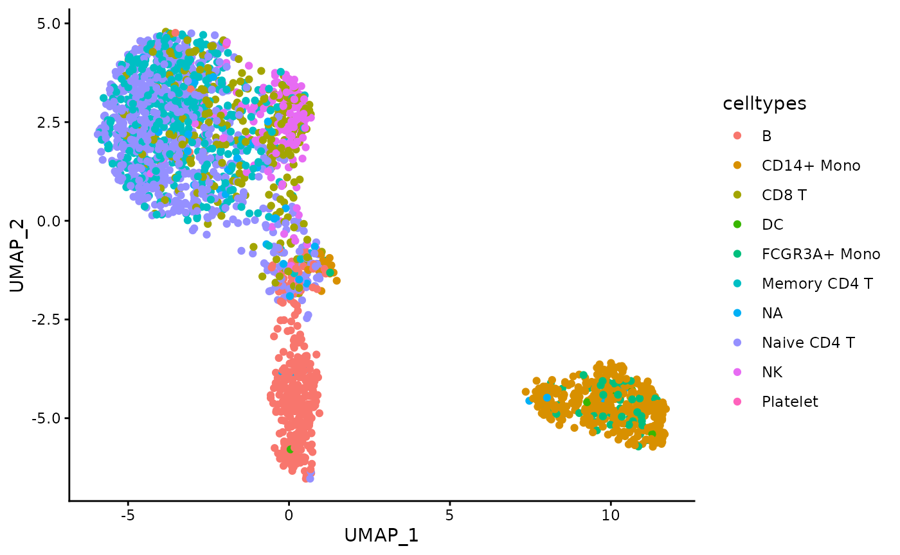
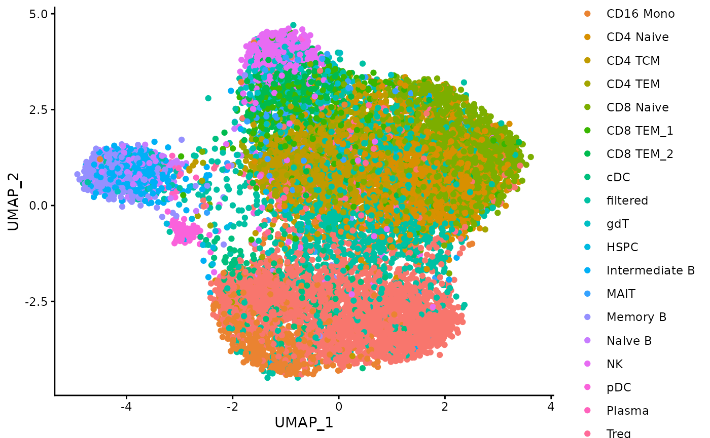

# Flexibility of the dimensionality reduction assessment

``` r

is_seuratdata <- require("SeuratData", quietly = TRUE)
if (!is_seuratdata) {
    devtools::install_github('satijalab/seurat-data', upgrade = "never")
}

is_harmony <- require("harmony", quietly = TRUE)
```

    ## • This is Harmony2 version 2.0.5
    ## • Read the guide: run vignette("quickstart", package="harmony")
    ## • Get help: Visit the website at <https://korsunskylab.github.io/harmony2/> and
    ## report issues on <https://github.com/immunogenomics/harmony/issues>

``` r

if (!is_harmony) {
    install.packages("harmony", repos = "https://cloud.r-project.org")
}

is_rsamtool <- require("Rsamtools", quietly = TRUE)
```

    ## 
    ## Attaching package: 'BiocGenerics'
    ## 
    ## The following objects are masked from 'package:stats':
    ## 
    ##     IQR, mad, sd, var, xtabs
    ## 
    ## The following objects are masked from 'package:base':
    ## 
    ##     anyDuplicated, aperm, append, as.data.frame, basename, cbind,
    ##     colnames, dirname, do.call, duplicated, eval, evalq, Filter, Find,
    ##     get, grep, grepl, intersect, is.unsorted, lapply, Map, mapply,
    ##     match, mget, order, paste, pmax, pmax.int, pmin, pmin.int,
    ##     Position, rank, rbind, Reduce, rownames, sapply, saveRDS, setdiff,
    ##     table, tapply, union, unique, unsplit, which.max, which.min
    ## 
    ## 
    ## Attaching package: 'S4Vectors'
    ## 
    ## The following object is masked from 'package:utils':
    ## 
    ##     findMatches
    ## 
    ## The following objects are masked from 'package:base':
    ## 
    ##     expand.grid, I, unname
    ## 
    ## 
    ## Attaching package: 'Biostrings'
    ## 
    ## The following object is masked from 'package:base':
    ## 
    ##     strsplit

``` r

if (!is_rsamtool) {
    is_biocmanager <- require("BiocManager", quietly = TRUE)
    if (!is_biocmanager) {
        install.packages("BiocManager", repos = "https://cloud.r-project.org")
        library(BiocManager)
    }

    install("Rsamtools")
}
```

``` r

library(Seurat)
```

    ## Loading required package: SeuratObject

    ## Loading required package: sp

    ## 
    ## Attaching package: 'sp'

    ## The following object is masked from 'package:IRanges':
    ## 
    ##     %over%

    ## 'SeuratObject' was built under R 4.4.0 but the current version is
    ## 4.4.3; it is recomended that you reinstall 'SeuratObject' as the ABI
    ## for R may have changed

    ## 
    ## Attaching package: 'SeuratObject'

    ## The following object is masked from 'package:Biostrings':
    ## 
    ##     intersect

    ## The following object is masked from 'package:GenomicRanges':
    ## 
    ##     intersect

    ## The following object is masked from 'package:GenomeInfoDb':
    ## 
    ##     intersect

    ## The following object is masked from 'package:IRanges':
    ## 
    ##     intersect

    ## The following object is masked from 'package:S4Vectors':
    ## 
    ##     intersect

    ## The following object is masked from 'package:BiocGenerics':
    ## 
    ##     intersect

    ## The following objects are masked from 'package:base':
    ## 
    ##     intersect, t

``` r

library(SeuratData)
library(ClustAssess)
library(ggplot2)
library(harmony)
library(data.table)
```

    ## 
    ## Attaching package: 'data.table'

    ## The following object is masked from 'package:GenomicRanges':
    ## 
    ##     shift

    ## The following object is masked from 'package:IRanges':
    ## 
    ##     shift

    ## The following objects are masked from 'package:S4Vectors':
    ## 
    ##     first, second

``` r

library(Rsamtools)

n_repetitions <- 30
```

The `matrix processing` parameter of the `assess_feature_stability`
function is a function that enables the user to specify any method to
perform the dimensionality reduction prior to applying the UMAP
algorithm and the clustering pipeline. By default, the dimensionality
reduction used in `ClustAssess` is a precise PCA using the `prcomp`
package. However, this function can be easily changed, as it will be
shown in the following examples.

## ClustAssess using PCA

For the PCA example, we will use the PBMC 3k dataset from the
`SeuratData` package. The preprocessing of the dataset is identical with
the one performed in the stability pipeline vignette.

``` r

options(timeout=3600)
InstallData("pbmc3k")
```

    ## Installing package into '/home/runner/work/_temp/Library'
    ## (as 'lib' is unspecified)

``` r

data("pbmc3k")
pbmc3k <- UpdateSeuratObject(pbmc3k)
```

    ## Validating object structure

    ## Updating object slots

    ## Ensuring keys are in the proper structure

    ## Warning: Assay RNA changing from Assay to Assay

    ## Ensuring keys are in the proper structure

    ## Ensuring feature names don't have underscores or pipes

    ## Updating slots in RNA

    ## Validating object structure for Assay 'RNA'

    ## Object representation is consistent with the most current Seurat version

``` r

pbmc3k <- PercentageFeatureSet(pbmc3k, pattern = "^MT-", col.name = "percent.mito")
pbmc3k <- PercentageFeatureSet(pbmc3k, pattern = "^RP[SL][[:digit:]]", col.name = "percent.rp")
# remove MT and RP genes
all.index <- seq_len(nrow(pbmc3k))
MT.index <- grep(pattern = "^MT-", x = rownames(pbmc3k), value = FALSE)
RP.index <- grep(pattern = "^RP[SL][[:digit:]]", x = rownames(pbmc3k), value = FALSE)
pbmc3k <- pbmc3k[!((all.index %in% MT.index) | (all.index %in% RP.index)), ]
pbmc3k <- subset(pbmc3k, nFeature_RNA < 2000 & nCount_RNA < 2500 & percent.mito < 7 & percent.rp > 7)
pbmc3k <- NormalizeData(pbmc3k, verbose = FALSE)
pbmc3k <- FindVariableFeatures(pbmc3k, selection.method = "vst", nfeatures = 3000, verbose = FALSE)

features <- dimnames(pbmc3k@assays$RNA)[[1]]
var_features <- pbmc3k@assays[["RNA"]]@var.features
n_abundant <- 3000
most_abundant_genes <- rownames(pbmc3k@assays$RNA)[order(Matrix::rowSums(pbmc3k@assays$RNA),
    decreasing = TRUE
)]

pbmc3k <- ScaleData(pbmc3k, features = features, verbose = FALSE)
```

We notice that the `seurat_annotations` column has some missing values.
For simplicity, we will replace them with “NA”.

``` r

mask <- is.na(pbmc3k$seurat_annotations)
pbmc3k$seurat_annotations <- as.character(pbmc3k$seurat_annotations)
pbmc3k$seurat_annotations[mask] <- "NA"
```

Select the features used for the stability assessment.

``` r

features <- dimnames(pbmc3k@assays$RNA)[[1]]
var_features <- pbmc3k@assays[["RNA"]]@var.features
n_abundant <- 3000
most_abundant_genes <- rownames(pbmc3k@assays$RNA)[order(Matrix::rowSums(pbmc3k@assays$RNA),
    decreasing = TRUE
)]

steps <- seq(from = 500, to = 3000, by = 500)
ma_hv_genes_intersection_sets <- sapply(steps, function(x) intersect(most_abundant_genes[1:x], var_features[1:x]))
ma_hv_genes_intersection <- Reduce(union, ma_hv_genes_intersection_sets)
ma_hv_steps <- sapply(ma_hv_genes_intersection_sets, length)
```

Assess the stability of the dimensionality reduction when PCA is used as
dimensionality reduction.

``` r

matrix_processing_function <- function(dt_mtx, actual_npcs = 30) {
    actual_npcs <- min(actual_npcs, ncol(dt_mtx) %/% 2)

    RhpcBLASctl::blas_set_num_threads(foreach::getDoParWorkers())
    embedding <- stats::prcomp(x = dt_mtx, rank. = actual_npcs)$x

    RhpcBLASctl::blas_set_num_threads(1)
    rownames(embedding) <- rownames(dt_mtx)
    colnames(embedding) <- paste0("PC_", seq_len(actual_npcs))

    return(embedding)
}

pca_feature_stability <- assess_feature_stability(
    data_matrix = pbmc3k@assays[["RNA"]]@scale.data,
    feature_set = most_abundant_genes,
    resolution = seq(from = 0.1, to = 1, by = 0.1),
    steps = steps,
    n_repetitions = n_repetitions,
    feature_type = "MA",
    graph_reduction_type = "PCA",
    matrix_processing = matrix_processing_function,
    umap_arguments = list(
        min_dist = 0.3,
        n_neighbors = 30,
        metric = "cosine"
    ),
    ecs_thresh = 1,
    clustering_algorithm = 1
)
```

    ## Warning: executing %dopar% sequentially: no parallel backend registered

Plot the distribution of the celltypes on the UMAP embedding obtained on
the top 1000 Most Abundant genes.

``` r

umap_df <- data.frame(pca_feature_stability$embedding_list$MA$"1000")
umap_df$celltypes <- pbmc3k$seurat_annotations
ggplot(umap_df, aes(x = UMAP_1, y = UMAP_2, color = celltypes)) +
    geom_point() +
    theme_classic()
```



## ClustAssess using Harmony

We can also modify the function by adding an addition post-processing
step to the PCA. In this example, we will use the Harmony correction to
remove the “batch effect” created by the celltypes. *Note*: This example
is meant to exemplify how to use the Harmony correction in the
ClusAssess pipeline. The batch correction is actually not needed in the
PBMC 3k dataset.

``` r

matrix_processing_function <- function(dt_mtx, actual_npcs = 30) {
    actual_npcs <- min(actual_npcs, ncol(dt_mtx) %/% 2)

    RhpcBLASctl::blas_set_num_threads(foreach::getDoParWorkers())
    embedding <- stats::prcomp(x = dt_mtx, rank. = actual_npcs)$x

    RhpcBLASctl::blas_set_num_threads(1)
    rownames(embedding) <- rownames(dt_mtx)
    colnames(embedding) <- paste0("PC_", seq_len(actual_npcs))

    embedding <- RunHarmony(embedding, pbmc3k$seurat_annotations, verbose = FALSE)

    return(embedding)
}

pca_harmony_feature_stability <- assess_feature_stability(
    data_matrix = pbmc3k@assays[["RNA"]]@scale.data,
    feature_set = most_abundant_genes,
    resolution = seq(from = 0.1, to = 1, by = 0.1),
    steps = steps,
    n_repetitions = n_repetitions,
    feature_type = "MA",
    graph_reduction_type = "PCA",
    matrix_processing = matrix_processing_function,
    umap_arguments = list(
        min_dist = 0.3,
        n_neighbors = 30,
        metric = "cosine"
    ),
    ecs_thresh = 1,
    clustering_algorithm = 1,
    verbose = TRUE
)
```

Plot the distribution of the celltypes on the UMAP embedding obtained on
the top 1000 Most Abundant genes.

``` r

umap_df <- data.frame(pca_harmony_feature_stability$embedding_list$MA$"1000")
umap_df$celltypes <- pbmc3k$seurat_annotations
ggplot(umap_df, aes(x = UMAP_1, y = UMAP_2, color = celltypes)) +
    geom_point() +
    theme_classic()
```



## ClustAssess in the scATAC-seq data

In this example we will showcase the flexibility of the
`assess_feature_stability` function by using the ATAC-seq data. For this
example, we will use the multiome PBMC dataset from the `SeuratData`
package.

``` r

library(Signac)
InstallData("pbmcMultiome")
```

    ## Installing package into '/home/runner/work/_temp/Library'
    ## (as 'lib' is unspecified)

``` r

data("pbmc.atac")
```

As presented in the
(Signac)(<https://stuartlab.org/signac/articles/pbmc_vignette>) package,
the ATAC-seq data is usually processed using the TF-IDF normalization
followed by the the calculation of the singular values. These two steps
are also known as LSI (Latent Semantic Indexing).

``` r

pbmc.atac <- RunTFIDF(pbmc.atac)
```

    ## Performing TF-IDF normalization

    ## Warning in RunTFIDF.default(object = GetAssayData(object = object, layer =
    ## "counts"), : Some features contain 0 total counts

Identify the highly variable peaks.

``` r

pbmc.atac <- FindTopFeatures(pbmc.atac, min.cutoff = "q5")
var_peaks <- pbmc.atac@assays$ATAC@var.features[seq_len(3000)]
```

To speedup the assessment, set a parallel backend with 6 cores.

``` r

RhpcBLASctl::blas_set_num_threads(1)
ncores <- 1
if (ncores > 1) {
    my_cluster <- parallel::makeCluster(
        ncores,
        type = "PSOCK"
    )

    doParallel::registerDoParallel(cl = my_cluster)
}
```

Assess the stability of the dimensionality reduction by varying the
number of highly variable peaks.

``` r

matrix_processing_function <- function(dt_mtx, actual_n_singular_values = 50) {
    actual_n_singular_values <- min(actual_n_singular_values, ncol(dt_mtx) %/% 2)

    RhpcBLASctl::blas_set_num_threads(foreach::getDoParWorkers())
    embedding <- RunSVD(Matrix::t(dt_mtx), n = actual_n_singular_values, verbose = FALSE)@cell.embeddings
    # remove the first component, as it does contain noise - see the Signac vignette
    embedding <- embedding[, 2:actual_n_singular_values]

    RhpcBLASctl::blas_set_num_threads(1)
    rownames(embedding) <- rownames(dt_mtx)
    colnames(embedding) <- paste0("LSI_", seq_len(actual_n_singular_values - 1))

    return(embedding)
}

lsi_atac_feature_stability <- assess_feature_stability(
    data_matrix = pbmc.atac@assays[["ATAC"]]@data,
    feature_set = var_peaks,
    resolution = seq(from = 0.1, to = 1, by = 0.1),
    steps = steps,
    n_repetitions = n_repetitions,
    feature_type = "HV_peaks",
    graph_reduction_type = "PCA",
    matrix_processing = matrix_processing_function,
    umap_arguments = list(
        min_dist = 0.3,
        n_neighbors = 30,
        metric = "cosine"
    ),
    ecs_thresh = 1,
    clustering_algorithm = 1,
    verbose = TRUE
)
```

    ## Warning: No assay specified, setting assay as RNA by default.
    ## No assay specified, setting assay as RNA by default.
    ## No assay specified, setting assay as RNA by default.
    ## No assay specified, setting assay as RNA by default.
    ## No assay specified, setting assay as RNA by default.
    ## No assay specified, setting assay as RNA by default.

``` r

foreach::registerDoSEQ()
```

Plot the distribution of the celltypes on the UMAP embedding obtained on
the top 1000 Highly Variable peaks.

``` r

umap_df <- data.frame(lsi_atac_feature_stability$embedding_list$HV_peaks$"1000")
umap_df$celltypes <- pbmc.atac$seurat_annotations
ggplot(umap_df, aes(x = UMAP_1, y = UMAP_2, color = celltypes)) +
    geom_point() +
    theme_classic()
```



## Session info

``` r

sessionInfo()
```

    ## R version 4.4.3 (2025-02-28)
    ## Platform: x86_64-pc-linux-gnu
    ## Running under: Ubuntu 24.04.4 LTS
    ## 
    ## Matrix products: default
    ## BLAS:   /usr/lib/x86_64-linux-gnu/openblas-pthread/libblas.so.3 
    ## LAPACK: /usr/lib/x86_64-linux-gnu/openblas-pthread/libopenblasp-r0.3.26.so;  LAPACK version 3.12.0
    ## 
    ## locale:
    ##  [1] LC_CTYPE=C.UTF-8       LC_NUMERIC=C           LC_TIME=C.UTF-8       
    ##  [4] LC_COLLATE=C.UTF-8     LC_MONETARY=C.UTF-8    LC_MESSAGES=C.UTF-8   
    ##  [7] LC_PAPER=C.UTF-8       LC_NAME=C              LC_ADDRESS=C          
    ## [10] LC_TELEPHONE=C         LC_MEASUREMENT=C.UTF-8 LC_IDENTIFICATION=C   
    ## 
    ## time zone: UTC
    ## tzcode source: system (glibc)
    ## 
    ## attached base packages:
    ## [1] stats4    stats     graphics  grDevices utils     datasets  methods  
    ## [8] base     
    ## 
    ## other attached packages:
    ##  [1] pbmcMultiome.SeuratData_0.1.4 Signac_1.17.1                
    ##  [3] pbmc3k.SeuratData_3.1.4       data.table_1.18.6.1          
    ##  [5] ggplot2_4.0.3                 ClustAssess_1.2.0            
    ##  [7] Seurat_5.5.1                  SeuratObject_5.4.0           
    ##  [9] sp_2.2-3                      Rsamtools_2.22.0             
    ## [11] Biostrings_2.74.1             XVector_0.46.0               
    ## [13] GenomicRanges_1.58.0          GenomeInfoDb_1.42.3          
    ## [15] IRanges_2.40.1                S4Vectors_0.44.0             
    ## [17] BiocGenerics_0.52.0           harmony_2.0.5                
    ## [19] Rcpp_1.1.2                    SeuratData_0.2.2.9002        
    ## 
    ## loaded via a namespace (and not attached):
    ##   [1] RColorBrewer_1.1-3       jsonlite_2.0.0           magrittr_2.0.5          
    ##   [4] spatstat.utils_3.2-4     farver_2.1.2             rmarkdown_2.31          
    ##   [7] zlibbioc_1.52.0          fs_2.1.0                 ragg_1.5.2              
    ##  [10] vctrs_0.7.3              ROCR_1.0-12              spatstat.explore_3.8-2  
    ##  [13] RcppRoll_0.3.2           progress_1.2.3           htmltools_0.5.9         
    ##  [16] sass_0.4.10              sctransform_0.4.3        parallelly_1.48.0       
    ##  [19] KernSmooth_2.23-26       bslib_0.12.0             htmlwidgets_1.6.4       
    ##  [22] desc_1.4.3               ica_1.0-3                plyr_1.8.9              
    ##  [25] plotly_4.12.1            zoo_1.9-0                cachem_1.1.0            
    ##  [28] igraph_2.3.3             iterators_1.0.14         mime_0.13               
    ##  [31] lifecycle_1.0.5          pkgconfig_2.0.3          Matrix_1.7-2            
    ##  [34] R6_2.6.1                 fastmap_1.2.0            MatrixGenerics_1.18.1   
    ##  [37] GenomeInfoDbData_1.2.13  fitdistrplus_1.2-6       future_1.75.0           
    ##  [40] shiny_1.14.0             digest_0.6.39            patchwork_1.3.2         
    ##  [43] tensor_1.5.1             RSpectra_0.16-2          irlba_2.3.7             
    ##  [46] textshaping_1.0.5        labeling_0.4.3           progressr_1.0.0         
    ##  [49] spatstat.sparse_3.2-0    httr_1.4.8               polyclip_1.10-7         
    ##  [52] abind_1.4-8              compiler_4.4.3           withr_3.0.3             
    ##  [55] S7_0.2.2                 BiocParallel_1.40.2      fastDummies_1.7.6       
    ##  [58] MASS_7.3-64              rappdirs_0.3.4           tools_4.4.3             
    ##  [61] lmtest_0.9-40            otel_0.2.0               httpuv_1.6.17           
    ##  [64] future.apply_1.20.2      goftest_1.2-3            glue_1.8.1              
    ##  [67] nlme_3.1-167             promises_1.5.0           grid_4.4.3              
    ##  [70] Rtsne_0.17               cluster_2.1.8            reshape2_1.4.5          
    ##  [73] generics_0.1.4           gtable_0.3.6             spatstat.data_3.1-9     
    ##  [76] tidyr_1.3.2              hms_1.1.4                spatstat.geom_3.8-2     
    ##  [79] RcppAnnoy_0.0.23         foreach_1.5.2            ggrepel_0.9.8           
    ##  [82] RANN_2.6.3               pillar_1.11.1            stringr_1.6.0           
    ##  [85] spam_2.11-4              RcppHNSW_0.7.0           later_1.4.8             
    ##  [88] splines_4.4.3            dplyr_1.2.1              lattice_0.22-6          
    ##  [91] survival_3.8-3           deldir_2.0-4             tidyselect_1.2.1        
    ##  [94] miniUI_0.1.2             pbapply_1.7-4            knitr_1.51              
    ##  [97] gridExtra_2.3.1          scattermore_1.2          RhpcBLASctl_0.23-42     
    ## [100] xfun_0.60                matrixStats_1.5.0        stringi_1.8.9           
    ## [103] UCSC.utils_1.2.0         yaml_2.3.12              evaluate_1.0.5          
    ## [106] codetools_0.2-20         tibble_3.3.1             cli_3.6.6               
    ## [109] uwot_0.2.4               xtable_1.8-8             reticulate_1.46.0       
    ## [112] systemfonts_1.3.2        jquerylib_0.1.4          globals_0.19.1          
    ## [115] spatstat.random_3.5-1    png_0.1-9                spatstat.univar_3.2-0   
    ## [118] parallel_4.4.3           pkgdown_2.2.1            prettyunits_1.2.0       
    ## [121] dotCall64_1.2            sparseMatrixStats_1.18.0 bitops_1.1-0            
    ## [124] listenv_1.0.0            viridisLite_0.4.3        scales_1.4.0            
    ## [127] ggridges_0.5.7           purrr_1.2.2              crayon_1.5.3            
    ## [130] rlang_1.3.0              fastmatch_1.1-8          cowplot_1.2.0
