# Stability-based parameter assessment

Make sure you have Rtools installed:
<https://cran.r-project.org/bin/windows/Rtools/rtools42/rtools.html> In
case some packages cannot be installed because of the locks, remove and
reinstall them.

Load the libraries.

``` r

library(RhpcBLASctl)
library(SeuratData)
library(patchwork)
library(Matrix)
#> Warning: package 'Matrix' was built under R version 4.4.1
library(Seurat)
#> Loading required package: SeuratObject
#> Warning: package 'SeuratObject' was built under R version 4.4.1
#> Loading required package: sp
#> Warning: package 'sp' was built under R version 4.4.1
#> 
#> Attaching package: 'SeuratObject'
#> The following objects are masked from 'package:base':
#> 
#>     intersect, t
library(ggplot2)
library(ClustAssess)
reticulate::py_install(c("leidenalg", "six"), python = Sys.getenv("RETICULATE_PYTHON"))
#> Using virtual environment '~/.virtualenvs/r-reticulate' ...
#> + /home/andi/.virtualenvs/r-reticulate/bin/python -m pip install --upgrade --no-user leidenalg six
packageVersion("ClustAssess") # should be 1.2.0
#> [1] '1.2.0'
```

## Calculating ECS, ECC

In the following we will test the functionality of the `ClustAssess`
package in terms of calculating the ECS and ECC.

``` r

mb1 <- c(1, 1, 1, 2, 2, 2, 3, 3)
mb2 <- c(1, 2, 1, 2, 2, 2, 3, 3)

# calculate the ECS score for each observation
print(element_sim_elscore(mb1, mb2))
#> [1] 0.6666667 0.2500000 0.6666667 0.7500000 0.7500000 0.7500000 1.0000000 1.0000000
# calculate the average ECS
print(mean(element_sim_elscore(mb1, mb2)))
#> [1] 0.7291667
print(element_sim(mb1, mb2))
#> [1] 0.7291667
```

``` r

# create a list of 10 random partitions
list_mbs <- lapply(1:10, function(i) {
    sample.int(4, 5, replace = TRUE)
})
print(list_mbs)
#> [[1]]
#> [1] 3 3 3 3 4
#> 
#> [[2]]
#> [1] 3 4 3 2 2
#> 
#> [[3]]
#> [1] 4 4 4 4 4
#> 
#> [[4]]
#> [1] 1 1 3 2 3
#> 
#> [[5]]
#> [1] 2 2 4 3 4
#> 
#> [[6]]
#> [1] 1 4 2 3 2
#> 
#> [[7]]
#> [1] 2 3 4 1 2
#> 
#> [[8]]
#> [1] 4 1 4 2 4
#> 
#> [[9]]
#> [1] 3 2 2 2 4
#> 
#> [[10]]
#> [1] 1 2 4 3 1
element_consistency(list_mbs)
#> [1] 0.4918519 0.5451852 0.4925926 0.5740741 0.5385185
```

## Stability pipeline

### Reading the data

In this vignette we illustrate a data-driven pipeline for the assessment
of optimal clustering parameters for a single-cell RNA-seq dataset.
Popular pipelines for single-cell clustering (including
[Seurat](https://satijalab.org/seurat/),
[SCANPY](https://scanpy.readthedocs.io/en/stable/), and [Monocle
v3](https://cole-trapnell-lab.github.io/monocle3/)) consist of a
sequence of steps, including normalization, dimensionality reduction,
nearest-neighbor graph construction, and community detection on that
graph. The obtained communities are then the clusters, which can be used
for downstream analysis by looking at marker genes, trajectories, and
more. ClustAssess offers a set of tools to assess the stability of
parameters in the clustering pipeline, for the steps of dimensionality
reduction, nearest-neighbor graph construction, and community detection.

To illustrate these tools, we will use the PBMC 3k dataset as it is
provided in the [SeuratData](https://github.com/satijalab/seurat-data)
package. The input is provided as a 13714x 2700 expression level matrix
containing the raw quantification (in csv format).

``` r

InstallData("pbmc3k")
#> Warning: The following packages are already installed and will not be reinstalled: pbmc3k
data("pbmc3k")
pbmc3k <- UpdateSeuratObject(pbmc3k)
#> Validating object structure
#> Updating object slots
#> Ensuring keys are in the proper structure
#> Warning: Assay RNA changing from Assay to Assay
#> Ensuring keys are in the proper structure
#> Ensuring feature names don't have underscores or pipes
#> Updating slots in RNA
#> Validating object structure for Assay 'RNA'
#> Object representation is consistent with the most current Seurat version
pbmc3k
#> An object of class Seurat 
#> 13714 features across 2700 samples within 1 assay 
#> Active assay: RNA (13714 features, 0 variable features)
#>  2 layers present: counts, data
```

``` r

pbmc3k <- PercentageFeatureSet(pbmc3k, pattern = "^MT-", col.name = "percent.mito")
pbmc3k <- PercentageFeatureSet(pbmc3k, pattern = "^RP[SL][[:digit:]]", col.name = "percent.rp")
```

The analysis is based on the Seurat pipeline ([Hao et al 2021,
Integrated analysis of multimodal single-cell
data](https://doi.org/10.1016/j.cell.2021.04.048)); after creating the
object and recording the mitochondrial and ribosomal gene percentages,
those genes are excluded from the downstream analysis.

### Quality checks

We remove the mithocondrial and ribosomal genes.

``` r

# remove MT and RP genes
all.index <- seq_len(nrow(pbmc3k))
MT.index <- grep(pattern = "^MT-", x = rownames(pbmc3k), value = FALSE)
RP.index <- grep(pattern = "^RP[SL][[:digit:]]", x = rownames(pbmc3k), value = FALSE)
pbmc3k <- pbmc3k[!((all.index %in% MT.index) | (all.index %in% RP.index)), ]
```

We plot the violin plots to visualise the distribution of the number of
features, number of counts, percentage of mitochondrial genes, and
percentage of ribosomal genes.

``` r

patchwork::wrap_plots(VlnPlot(pbmc3k, features = c("nFeature_RNA", "nCount_RNA", "percent.mito", "percent.rp"), combine = FALSE), ncol = 2)
#> Warning: `aes_string()` was deprecated in ggplot2 3.0.0.
#> ℹ Please use tidy evaluation idioms with `aes()`.
#> ℹ See also `vignette("ggplot2-in-packages")` for more information.
#> ℹ The deprecated feature was likely used in the Seurat package.
#>   Please report the issue at <https://github.com/satijalab/seurat/issues>.
#> This warning is displayed once per session.
#> Call `lifecycle::last_lifecycle_warnings()` to see where this warning was generated.
```

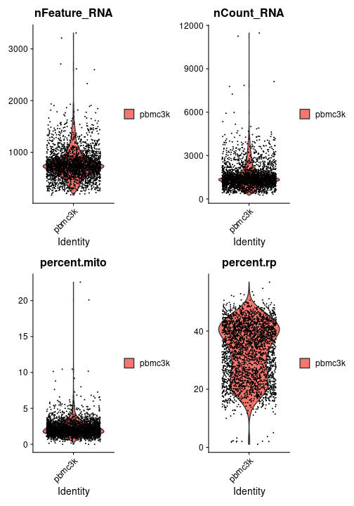

After the quality control step, we filter the dataset using the
following criteria: - the number of features is less than 2000 - the
number of counts is less than 2500 - the percentage of mitochondrial
genes is less than 7% - the percentage of ribosomal genes is greater
than 7%

``` r

pbmc3k <- subset(pbmc3k, nFeature_RNA < 2000 & nCount_RNA < 2500 & percent.mito < 7 & percent.rp > 7)
```

We plot again the violin plots to see the distribution of the features
after the filtering step.

``` r

patchwork::wrap_plots(VlnPlot(pbmc3k, features = c("nFeature_RNA", "nCount_RNA", "percent.mito", "percent.rp"), combine = FALSE), ncol = 2)
```

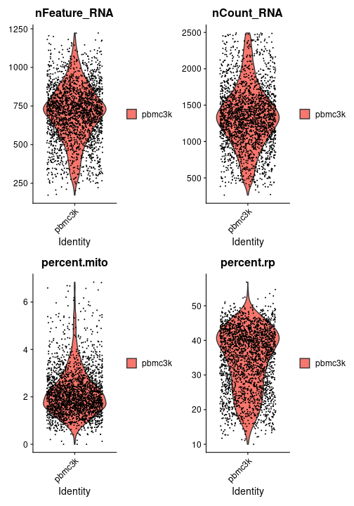

### Normalization and scaling

The data is normalized and scaled using the Seurat’s `NormalizeData` and
`ScaleData` methods. The variable feature set is obtained by running the
`FindVariableFeatures` function from the same package.

``` r

pbmc3k <- NormalizeData(pbmc3k, verbose = FALSE)
pbmc3k <- FindVariableFeatures(pbmc3k, selection.method = "vst", nfeatures = 3000, verbose = FALSE)

features <- dimnames(pbmc3k@assays$RNA)[[1]]
var_features <- pbmc3k@assays[["RNA"]]@var.features
n_abundant <- 3000
most_abundant_genes <- rownames(pbmc3k@assays$RNA)[order(Matrix::rowSums(pbmc3k@assays$RNA),
    decreasing = TRUE
)]

pbmc3k <- ScaleData(pbmc3k, features = features, verbose = FALSE)

pbmc3k <- RunPCA(pbmc3k,
    npcs = 30,
    approx = FALSE,
    verbose = FALSE,
    features = intersect(most_abundant_genes, pbmc3k@assays$RNA@var.features)
)
pbmc3k <- RunUMAP(pbmc3k,
    reduction = "pca",
    dims = 1:30,
    n.neighbors = 30,
    min.dist = 0.3,
    metric = "cosine",
    verbose = FALSE
)
raw_umap <- data.frame(pbmc3k@reductions$umap@cell.embeddings)
```

We generate the following plots: A - the distribution of the predefined
Seurat celltype annotations; B – E distributions of sequencing depths
(B), number of features (C), and percentages of reads incident to
mitochondrial genes (D) and ribosomal genes (E) illustrated using the
colour gradient.

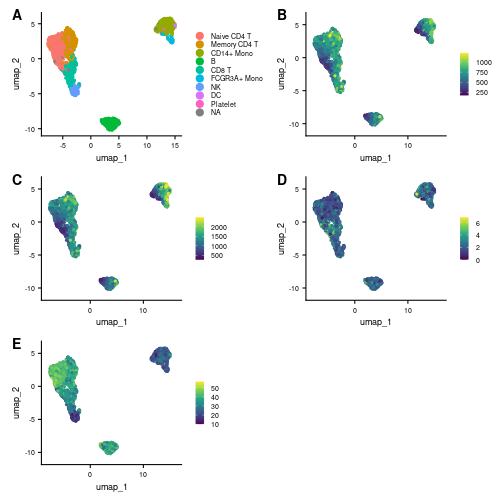

### Effect of the random seed

To illustrate the necessity of obtaining reproducible and robust
clustering outputs, we will perform only the clustering step several
times by only changing the random seed.

``` r

pbmc3k <- FindNeighbors(pbmc3k)
#> Computing nearest neighbor graph
#> Computing SNN
clustering_list <- lapply(seq(from = 1, by = 100, length.out = 10), function(i) {
    pbmc3k <- FindClusters(pbmc3k, algorithm = 3, random.seed = i, verbose = FALSE)
    as.integer(pbmc3k$seurat_clusters)
})
```

We assess the stability of the clustering by calculating the consistency
of the 10 clustering outputs.

``` r

ecc_value <- merge_partitions(clustering_list, return_ecs_matrix = TRUE)
print(fivenum(ecc_value$ecc))
#> [1] 0.5437092 0.9953488 1.0000000 1.0000000 1.0000000
```

The similarity between the distinct partitions can be assessed by
accessing the `ecs_matrix` field.

``` r

print(ecc_value$ecs_matrix)
#>           [,1]      [,2]      [,3]
#> [1,] 1.0000000 0.9915337 0.9950592
#> [2,] 0.9915337 1.0000000 0.9866320
#> [3,] 0.9950592 0.9866320 1.0000000
```

The difference between clusters can be visualised using the ECC
distribution. Also, comparing the output of the clustering using the
second and the fourth seed, we notice that some cells from the top-left
island change their identity between the fifth and seventh cluster.

``` r

gplots <- list()
gplots[[1]] <- ggplot(raw_umap, aes(x = umap_1, y = umap_2, colour = ecc_value$ecc)) +
    geom_point() +
    theme_classic() +
    scale_colour_viridis_c()
raw_umap$clustering <- factor(clustering_list[[2]])
gplots[[2]] <- ggplot(raw_umap, aes(x = umap_1, y = umap_2, colour = clustering)) +
    geom_point() + theme_classic()
raw_umap$clustering <- factor(clustering_list[[4]])
gplots[[3]] <- ggplot(raw_umap, aes(x = umap_1, y = umap_2, colour = clustering)) +
    geom_point() + theme_classic()

wrap_plots(gplots)
```

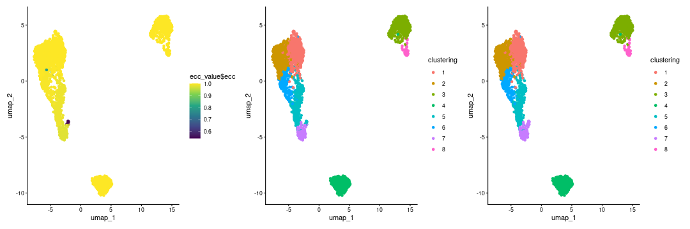

### Applying ClustAssess

*Note*: The following sections provide an example of applying the
ClustAssess summary assessment methods. The values of the parameters
should be varied and critically assessed for each individual dataset.
Also, we recommend increasing the number of repetitions used for
stability inference, to ensure reliable and robust conclusions.

``` r

n_repetitions <- 10
```

The following analysis is performed by varying the seed multiple times.
The pipeline can be run in parallel, so by initialising a backend with
multiple number of cores, the task will be split into the processess.
Setting the value of 1 will result in a sequential run of all
iterations. We encourage the usage of a higher number of cores when
possible, as it will decrease the runtime of the assessment pipeline.
Please note that the number of cores should be chosen carefully, as each
newly created process will add to the memory usage.

``` r

RhpcBLASctl::blas_set_num_threads(1)
ncores <- 1
if (ncores > 1) {
    my_cluster <- parallel::makeCluster(
        ncores,
        type = "PSOCK"
    )

    doParallel::registerDoParallel(cl = my_cluster)
}
```

#### Dimensionality reduction

The first parameter that we will evaluate and note to substantially
influence the dimensionality reduction (linear or non-linear) is the
feature set. The Seurat pipeline relies on the highly variable genes
(default) for the computation of the Principal Components. The top x
most variable genes or most abundant genes can be selected, where x
varies according to the characteristics of the dataset; frequently used
values are 500, 1000, 2000, 3000 etc.

To showcase the importance of this parameter, we assess three different
sets of features:

- **highly variable genes**: this set can be obtained in the Seurat
  pipeline by using either the `SCTransform` or `FindVariableFeatures`
  method. Depending on the method, using the default parameters will get
  a number of 2000 or 3000 genes.
- **most abundant genes**: this set can be obtained by sorting the genes
  based on their expression level.
- **intersection between highly variable and most abundant genes**: this
  set is obtained by intersecting a subset of the most abundant genes
  and the highly variable feature set. Taking the intersection will lead
  to a smaller number of genes compared to the initial sets.

``` r

steps <- seq(from = 500, to = 3000, by = 500)
ma_hv_genes_intersection_sets <- sapply(steps, function(x) intersect(most_abundant_genes[seq_len(x)], var_features[seq_len(x)]))
ma_hv_genes_intersection <- Reduce(union, ma_hv_genes_intersection_sets)
ma_hv_steps <- sapply(ma_hv_genes_intersection_sets, length)
```

`assess_feature_stability` is a function that explores the stability of
a feature set. The input consists of a normalized expression matrix,
that is summarized using either PCA or UMAP. The obtained embedding is
then processed using one of the community detection methods that are
used in the `Seurat` package. This process is iterated across random
seeds. The method outputs a list containing an UMAP embedding, the cell
assignment corresponding to the most frequent partition and the
Element-Centric Consistency (ECC) across all communities obtained
throughout the iterations. The higher the Element-Centric Consistency,
the more stable the clustering. To increase the robustness of the
stability assessment, we also vary the resolution parameter that
directly impacts the number of clusters.

``` r

pca_feature_stability_object <- mapply(c,
    assess_feature_stability(
        data_matrix = pbmc3k@assays[["RNA"]]@scale.data,
        feature_set = most_abundant_genes,
        resolution = seq(from = 0.1, to = 1, by = 0.1),
        steps = steps,
        n_repetitions = n_repetitions,
        feature_type = "MA",
        graph_reduction_type = "PCA",
        umap_arguments = list(
            min_dist = 0.3,
            n_neighbors = 30,
            metric = "cosine"
        ),
        ecs_thresh = 1,
        clustering_algorithm = 1
    ),
    assess_feature_stability(
        data_matrix = pbmc3k@assays[["RNA"]]@scale.data,
        feature_set = var_features,
        resolution = seq(from = 0.1, to = 1, by = 0.1),
        steps = steps,
        n_repetitions = n_repetitions,
        feature_type = "HV",
        graph_reduction_type = "PCA",
        umap_arguments = list(
            min_dist = 0.3,
            n_neighbors = 30,
            metric = "cosine"
        ),
        ecs_thresh = 1,
        clustering_algorithm = 1
    ),
    assess_feature_stability(
        data_matrix = pbmc3k@assays[["RNA"]]@scale.data,
        feature_set = ma_hv_genes_intersection,
        steps = ma_hv_steps,
        resolution = seq(from = 0.1, to = 1, by = 0.1),
        n_repetitions = n_repetitions,
        feature_type = "MA_HV",
        graph_reduction_type = "PCA",
        umap_arguments = list(
            min_dist = 0.3,
            n_neighbors = 30,
            metric = "cosine"
        ),
        ecs_thresh = 1,
        clustering_algorithm = 1
    ),
    SIMPLIFY = FALSE
)
```

The function `assess_feature_stability` outputs the stability of
different feature sets and concatenates the results to ease
cross-comparisons. The plot illustrates the stability assessment, across
30 runs, each with different random seeds, on the three gene sets
described above. We assessed the stability of each set on incremental
number of selected genes. Thus, the boxplots are arranged in groups of
three (the number of evaluated feature sets); above each boxplot we
specify the number of elements per subset. The user can interogate the
stability values that are obtained for each resolution value, as
indicated in the left-side panel, or the overall stability assessment
(which is determined by collecting the median of the ECC-distribution of
each resolution value), as it can be seen in the right-side panel.

For the PBMC case study, a conclusion that is supported based on this
plot is that configurations such as MA 500, 2000, 2500, 3000, HV 500,
1000, 1500, 2500 or MA_HV 65, 175, 425 are suitable choices for the
Principal Components Analysis, as the ECC score is high with a
low-variance distribution.

``` r

wrap_plots(
  plot_feature_per_resolution_stability_boxplot(pca_feature_stability_object, resolution = 0.8, text_size = 2.5, boxplot_width = 0.4, dodge_width = 0.7) +
    theme(
        legend.position = c(1, 0),
        legend.justification = c(1, 0)
    ),
  plot_feature_overall_stability_boxplot(pca_feature_stability_object, text_size = 2.5, boxplot_width = 0.4, dodge_width = 0.7) +
    theme(
        legend.position = c(1, 0),
        legend.justification = c(1, 0)
    )
)
```

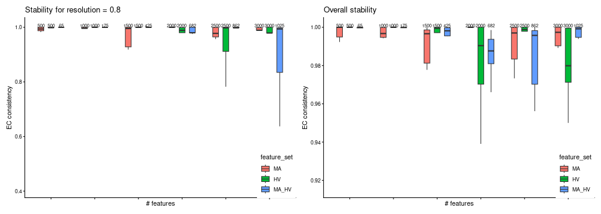

Another angle for assessing the stability is centered on the comparison
between consecutive steps, for each feature set, performed using the
Element-Centric Similarity on the most frequent partitions from each
step. The aim is evaluating the effect of increasing the number of genes
on the final partitions, and, indirectly, determining the transition
from the signal to the noise zone. For the PBMC case study, we observe
an increase in similarity between consecutive steps for the MA and MA_HV
genes, suggesting that selecting more genes would lead to a more robust
partitioning.

``` r

wrap_plots(
plot_feature_per_resolution_stability_incremental(pca_feature_stability_object, dodge_width = 0.6, resolution = 0.8, text_size = 2) +
    theme(
        legend.position = c(1, 0),
        legend.justification = c(1, 0)
    ),
plot_feature_overall_stability_incremental(pca_feature_stability_object, dodge_width = 0.6, text_size = 2) +
    theme(
        legend.position = c(1, 0),
        legend.justification = c(1, 0)
    )
)
```

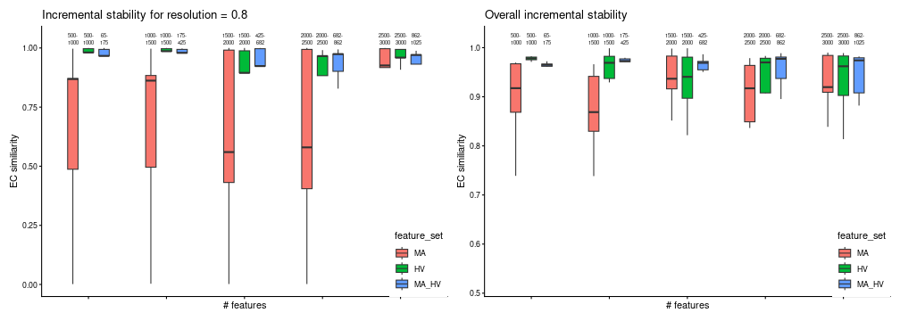

To enhance the summarized information presented as boxplots, we use
`plot_feature_stability_mb_facet` to visualize the corresponding facet
plot displaying the most frequent partitions for each feature set and
step on an UMAP embedding. This plot can reveal additional insights
i.e. the stability of a gene set might be explained in part by the
scattered distribution of the cells across multiple islands. For the
PBMC case study we notice a similar topology for all three feature sets.

``` r

plot_feature_stability_mb_facet(
    feature_object_list = pca_feature_stability_object,
    resolution = 0.8,
    text_size = 3,
    n_facet_cols = 6
)
```

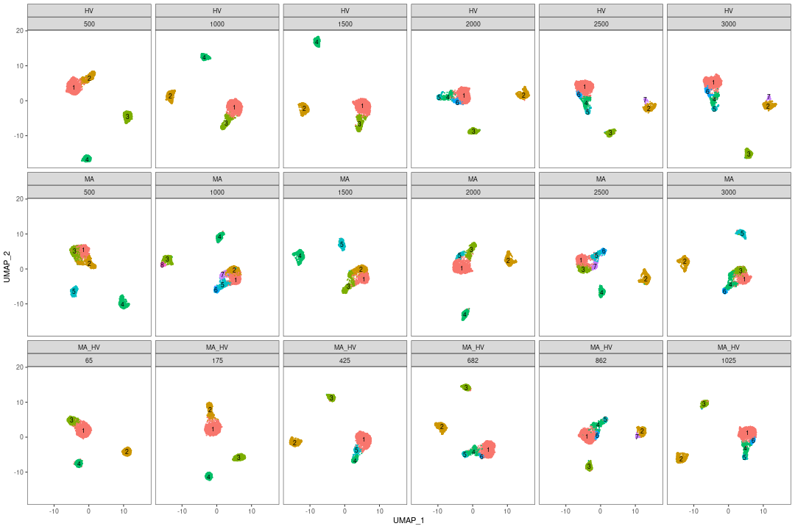

To further understand the areas of instability, we provide an additional
plot where we display, on the same UMAPs as before, the Element-Centric
Consistency score of the partitions obtained for each step and feature
set. In our case, we notice that the source of instability is located in
the main island of cells. These visualizations can help us understand
the relationship between stability and the topology of the data.

``` r

plot_feature_stability_ecs_facet(pca_feature_stability_object, resolution = 0.8, n_facet_cols = 6)
```

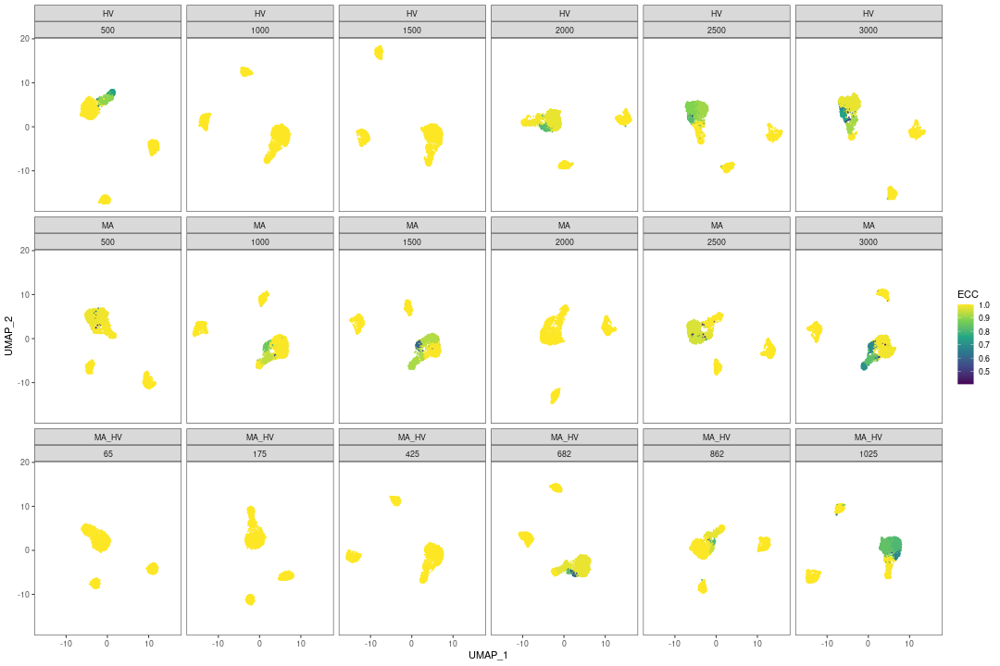

For the PBMC case study, based on the plots presented above, we conclude
that the feature set does not highly impact the topology of the data.
Judging by the consistency across multiple runs with different random
seeds and the incremental stability, we have select the top 1000 Highly
Variable genes.

``` r

pbmc3k <- pbmc3k[var_features[seq_len(1000)], ]

pbmc3k <- RunPCA(pbmc3k,
    npcs = 30,
    approx = FALSE,
    features = var_features,
    verbose = FALSE
)
pbmc3k<- RunUMAP(pbmc3k,
    reduction = "pca",
    dims = 1:30,
    n.neighbors = 30,
    min.dist = 0.3,
    metric = "cosine",
    verbose = FALSE
)
```

#### Graph construction

The next step in a standard single-cell analysis pipeline is building
the graph using the nearest neighbour algorithm. The following
parameters influence the final partitioning:

- **base embedding**: the graph can be built on either the PCA or the
  UMAP embedding (using the expression matrix isn’t recommended, as the
  distances would be noisier and the runtime would increase)
- **the number of neighbours**
- **the graph type**: the graph can be either unweighted (NN case) or
  based on a weighted Shared-Nearest Neighbours (SNN) graph. For the
  latter, the weights are computed using the Jaccard Similarity Index
  (JSI) between the neighbourhoods of two cells.

`get_nn_conn_comps` is a method used to link the number of neighbours
and the number of connected components (a connected component is a
subgraph within which there exists a path between every pair of nodes).
The method accepts as input both PCA and UMAP reductions; the
distribution of the number of connected components obtainable for the
given number of neighbours is calculated across random seeds. The output
is a list containing, for each number of neighbours, an array with the
number of connected components obtained on different seeds. As before,
the objects can be concatenated to facilitate comparisons between
different configurations and reductions.

``` r

nn_conn_comps_object <- get_nn_conn_comps(
    embedding = pbmc3k@reductions$pca@cell.embeddings,
    n_neigh_sequence = c(c(1, 2, 3, 4), seq(from = 5, to = 30, by = 5)),
    n_repetitions = n_repetitions,
    include_umap = TRUE,
    umap_arguments = list(
        min_dist = 0.3,
        n_neighbors = 30,
        metric = "cosine"
    )
)
```

The following plot describes the covariation between the number
neighbours and the number of connected components obtained using both
PCA and UMAP reductions as base for graph building. As the number of
neighbours increases, the number of connected components decreases (this
is an expected result, as increasing the number of neighbours result in
a better connected graph). Please note that the number of connected
components provides a lower bound on the number of clusters we can
obtain by downstream community detection algorithms such as Louvain and
Leiden.

Another comparison may be performed on the PCA and UMAP embeddings to
assess graph connectivity. We note that, when using UMAPs, groups of
cells are more separated compared to PCAs, for which a quick convergence
to a connected graph (which is a graph where there exists a path between
every two nodes) is obtained. The link between the number of connected
components and the functional interpretation of the results is that the
former could be interpreted as the minimum number of clusters that could
be obtained with the given number of neighbours e.g. for the UMAP case,
to obtain 5 communities from the clustering step, we would require at
least 5 nearest neighbours.

``` r

plot_connected_comps_evolution(nn_conn_comps_object)
#> Warning in ggplot2::scale_y_continuous(breaks = chosen_breaks, trans = "log10"): log-10 transformation introduced infinite values.
```

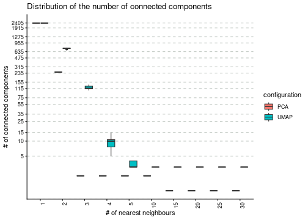

`get_nn_importance` is a method used for assessing the impact of number
of nearest neighbours, of the graph type (NN or SNN) and of the base
embedding (PCA or UMAP) in determining the final number of clusters. The
input is either a normalized expression matrix or a PCA embedding, a
range for the number of neighbours and the reduction type used for
building the graph. The graph type is not provided, as the method will
check both cases i.e. NN and SNN. The output comprises a list of
configurations (reduction type, and the graph type). Each configuration
will contain a list of unique partitions obtained from multiple runs
(iterations) for each selected value of the nearest neighbours.

``` r

nn_importance_object <- mapply(c,
    assess_nn_stability(
        embedding = pbmc3k@reductions$pca@cell.embeddings,
        n_neigh_sequence = seq(from = 5, to = 30, by = 5),
        n_repetitions = n_repetitions,
        graph_reduction_type = "PCA",
        ecs_thresh = 1,
        clustering_algorithm = 1
    ),
    assess_nn_stability(
        embedding = pbmc3k@reductions$pca@cell.embeddings,
        n_neigh_sequence = seq(from = 5, to = 30, by = 5),
        n_repetitions = n_repetitions,
        graph_reduction_type = "UMAP",
        ecs_thresh = 1,
        umap_arguments = list(
            min_dist = 0.3,
            n_neighbors = 30,
            metric = "cosine"
        ),
        clustering_algorithm = 1
    ),
    SIMPLIFY = FALSE
)
#> Warning in mapply(c, assess_nn_stability(embedding = pbmc3k@reductions$pca@cell.embeddings, : longer argument not a multiple of length of shorter
```

We input the resulting object into `plot_n_neigh_k_correspondence`, to
generate the following plot; it summarizes the relationship between the
number of nearest neighbours and k, the number of clusters. As for the
\# neighbours vs \# connected components correspondence plot, we note a
similar descending trend of the number of clusters as the number of
nearest neighbours increases. The plot also illustrates the difference
between the two graph types: SNN has a tighter distribution of k (over
multiple iterations) compared to NN. If the initial object contains
graphs based on both UMAP and PCA embedding, this plot will showcase the
impact of this choice, as well. For the PBMC dataset, we notice that the
UMAP-based graph is partitioned into a greater number of clusters
compared to the PCA case.

``` r

plot_n_neigh_k_correspondence(nn_importance_object)
#> Warning in ggplot2::scale_y_continuous(breaks = chosen_breaks, trans = "log10"): log-10 transformation introduced infinite values.
```

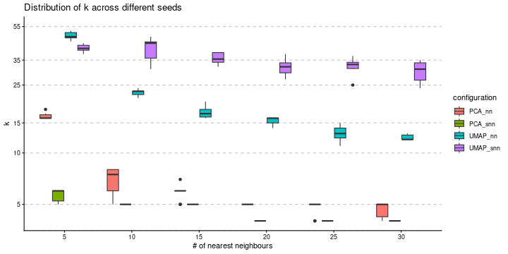

The stability of these parameters can be also evaluated using the
Element-Centric Consistency applied on the partition list obtained over
the multiple runs. The following summary plot underlines the evolution
of the consistency as the number of neighbours increases; the PCA graphs
yields stable results even for smaller number of nearest neighbours,
whereas the UMAP exhibits a stability improvement as the number of
neighbours increases. For the same number of nearest neighbors, SNN is
more stable than NN.

``` r

plot_n_neigh_ecs(nn_importance_object)
```

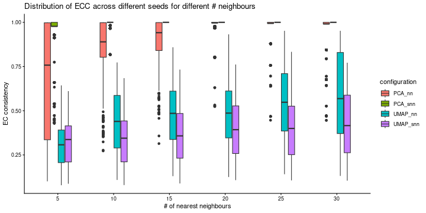

#### Graph clustering

The final step in a standard single-cell analysis pipeline is applying a
graph-based clustering method. Choosing a community detection algorithm
has a significant impact on the partitioning results. Using the
`get_clustering_difference` we assess the stability and reproducibility
of results obtained using various graph clustering methods available in
the Seurat package: Louvain, Louvain refined, SLM and Leiden.

``` r

adj_matrix <- FindNeighbors(pbmc3k@reductions$pca@cell.embeddings, k.param = 15, nn.method = "rann", verbose = F)$snn
```

As previously suggested, the resolution parameter affects the number of
clusters obtained. The `get_resolution_importance` evaluates the effect
of a range of values for the resolution parameter on the stability of
the output. Besides the resolution, the user can input multiple values
of the following parameters: number of neighbours, the graph type and
the clustering method. The function will return a list associated with
each parameter value combination. For each resolution value, the list
will contain multiple sublists of partitions corresponding to specific
number of clusters.

``` r
clustering_stability <- assess_clustering_stability(
    graph_adjacency_matrix = adj_matrix,
    resolution = seq(from = 0.1, to = 2, by = 0.1),
    n_repetitions = n_repetitions,
    clustering_algorithm = 1:4,
    ecs_thresh = 1
)
#> Unable to set up conda environment r-reticulate
#> run in terminal:
#> conda init
#> conda create -n r-reticulate
#> conda environment r-reticulate installed
#> Unable to install python modules igraph and leidenalg
#> run in terminal:
#> conda install -n r-reticulate -c conda-forge leidenalg python-igraph pandas umap-learn
#> python modules igraph and leidenalg installed
#> 
Louvain - res 0.1 [=>-----------------------------] eta: 28s  total elapsed:  1s
Louvain - res 0.2 [=>-----------------------------] eta: 28s  total elapsed:  1s
Louvain - res 0.2 [==>----------------------------] eta: 15s  total elapsed:  2s
Louvain - res 0.3 [==>----------------------------] eta: 15s  total elapsed:  2s
Louvain - res 0.3 [====>--------------------------] eta: 10s  total elapsed:  2s
Louvain - res 0.4 [====>--------------------------] eta: 10s  total elapsed:  2s
Louvain - res 0.4 [=====>-------------------------] eta:  8s  total elapsed:  2s
Louvain - res 0.5 [=====>-------------------------] eta:  8s  total elapsed:  2s
Louvain - res 0.5 [=======>-----------------------] eta:  7s  total elapsed:  2s
Louvain - res 0.6 [=======>-----------------------] eta:  7s  total elapsed:  2s
Louvain - res 0.6 [========>----------------------] eta:  6s  total elapsed:  2s
Louvain - res 0.7 [========>----------------------] eta:  6s  total elapsed:  2s
Louvain - res 0.7 [==========>--------------------] eta:  5s  total elapsed:  3s
Louvain - res 0.8 [==========>--------------------] eta:  5s  total elapsed:  3s
Louvain - res 0.8 [===========>-------------------] eta:  4s  total elapsed:  3s
Louvain - res 0.9 [===========>-------------------] eta:  4s  total elapsed:  3s
Louvain - res 0.9 [=============>-----------------] eta:  4s  total elapsed:  3s
Louvain - res 1 [==============>------------------] eta:  4s  total elapsed:  3s
Louvain - res 1 [===============>-----------------] eta:  3s  total elapsed:  3s
Louvain - res 1.1 [===============>---------------] eta:  3s  total elapsed:  3s
Louvain - res 1.1 [================>--------------] eta:  3s  total elapsed:  4s
Louvain - res 1.2 [================>--------------] eta:  3s  total elapsed:  4s
Louvain - res 1.2 [==================>------------] eta:  3s  total elapsed:  4s
Louvain - res 1.3 [==================>------------] eta:  3s  total elapsed:  4s
Louvain - res 1.3 [===================>-----------] eta:  2s  total elapsed:  4s
Louvain - res 1.4 [===================>-----------] eta:  2s  total elapsed:  4s
Louvain - res 1.4 [=====================>---------] eta:  2s  total elapsed:  4s
Louvain - res 1.5 [=====================>---------] eta:  2s  total elapsed:  4s
Louvain - res 1.5 [======================>--------] eta:  2s  total elapsed:  5s
Louvain - res 1.6 [======================>--------] eta:  2s  total elapsed:  5s
Louvain - res 1.6 [========================>------] eta:  1s  total elapsed:  5s
Louvain - res 1.7 [========================>------] eta:  1s  total elapsed:  5s
Louvain - res 1.7 [=========================>-----] eta:  1s  total elapsed:  5s
Louvain - res 1.8 [=========================>-----] eta:  1s  total elapsed:  5s
Louvain - res 1.8 [===========================>---] eta:  1s  total elapsed:  6s
Louvain - res 1.9 [===========================>---] eta:  1s  total elapsed:  6s
Louvain - res 1.9 [============================>--] eta:  0s  total elapsed:  6s
Louvain - res 2 [==============================>--] eta:  0s  total elapsed:  6s
Louvain - res 2 [=================================] eta:  0s  total elapsed:  7s
#> 
Louvain.refined - res 0.2 [=>---------------------] eta:  3s  total elapsed:  0s
Louvain.refined - res 0.3 [=>---------------------] eta:  3s  total elapsed:  0s
Louvain.refined - res 0.3 [==>--------------------] eta:  3s  total elapsed:  1s
Louvain.refined - res 0.4 [==>--------------------] eta:  3s  total elapsed:  1s
Louvain.refined - res 0.4 [====>------------------] eta:  3s  total elapsed:  1s
Louvain.refined - res 0.5 [====>------------------] eta:  3s  total elapsed:  1s
Louvain.refined - res 0.5 [=====>-----------------] eta:  3s  total elapsed:  1s
Louvain.refined - res 0.6 [=====>-----------------] eta:  3s  total elapsed:  1s
Louvain.refined - res 0.6 [======>----------------] eta:  3s  total elapsed:  1s
Louvain.refined - res 0.7 [======>----------------] eta:  3s  total elapsed:  1s
Louvain.refined - res 0.7 [=======>---------------] eta:  3s  total elapsed:  1s
Louvain.refined - res 0.8 [=======>---------------] eta:  3s  total elapsed:  1s
Louvain.refined - res 0.8 [========>--------------] eta:  2s  total elapsed:  2s
Louvain.refined - res 0.9 [========>--------------] eta:  2s  total elapsed:  2s
Louvain.refined - res 0.9 [=========>-------------] eta:  2s  total elapsed:  2s
Louvain.refined - res 1 [==========>--------------] eta:  2s  total elapsed:  2s
Louvain.refined - res 1 [===========>-------------] eta:  2s  total elapsed:  2s
Louvain.refined - res 1.1 [===========>-----------] eta:  2s  total elapsed:  2s
Louvain.refined - res 1.1 [============>----------] eta:  2s  total elapsed:  2s
Louvain.refined - res 1.2 [============>----------] eta:  2s  total elapsed:  2s
Louvain.refined - res 1.2 [=============>---------] eta:  2s  total elapsed:  3s
Louvain.refined - res 1.3 [=============>---------] eta:  2s  total elapsed:  3s
Louvain.refined - res 1.3 [==============>--------] eta:  1s  total elapsed:  3s
Louvain.refined - res 1.4 [==============>--------] eta:  1s  total elapsed:  3s
Louvain.refined - res 1.4 [===============>-------] eta:  1s  total elapsed:  3s
Louvain.refined - res 1.5 [===============>-------] eta:  1s  total elapsed:  3s
Louvain.refined - res 1.5 [================>------] eta:  1s  total elapsed:  3s
Louvain.refined - res 1.6 [================>------] eta:  1s  total elapsed:  3s
Louvain.refined - res 1.6 [=================>-----] eta:  1s  total elapsed:  4s
Louvain.refined - res 1.7 [=================>-----] eta:  1s  total elapsed:  4s
Louvain.refined - res 1.7 [===================>---] eta:  1s  total elapsed:  4s
Louvain.refined - res 1.8 [===================>---] eta:  1s  total elapsed:  4s
Louvain.refined - res 1.8 [====================>--] eta:  0s  total elapsed:  4s
Louvain.refined - res 1.9 [====================>--] eta:  0s  total elapsed:  4s
Louvain.refined - res 1.9 [=====================>-] eta:  0s  total elapsed:  5s
Louvain.refined - res 2 [=======================>-] eta:  0s  total elapsed:  5s
Louvain.refined - res 2 [=========================] eta:  0s  total elapsed:  5s
#> 
SLM - res 0.1 [=>---------------------------------] eta: 20s  total elapsed:  1s
SLM - res 0.2 [=>---------------------------------] eta: 20s  total elapsed:  1s
SLM - res 0.2 [===>-------------------------------] eta: 18s  total elapsed:  2s
SLM - res 0.3 [===>-------------------------------] eta: 18s  total elapsed:  2s
SLM - res 0.3 [====>------------------------------] eta: 17s  total elapsed:  3s
SLM - res 0.4 [====>------------------------------] eta: 17s  total elapsed:  3s
SLM - res 0.4 [======>----------------------------] eta: 16s  total elapsed:  4s
SLM - res 0.5 [======>----------------------------] eta: 16s  total elapsed:  4s
SLM - res 0.5 [========>--------------------------] eta: 16s  total elapsed:  5s
SLM - res 0.6 [========>--------------------------] eta: 16s  total elapsed:  5s
SLM - res 0.6 [=========>-------------------------] eta: 15s  total elapsed:  6s
SLM - res 0.7 [=========>-------------------------] eta: 15s  total elapsed:  6s
SLM - res 0.7 [===========>-----------------------] eta: 14s  total elapsed:  8s
SLM - res 0.8 [===========>-----------------------] eta: 14s  total elapsed:  8s
SLM - res 0.8 [=============>---------------------] eta: 13s  total elapsed:  9s
SLM - res 0.9 [=============>---------------------] eta: 13s  total elapsed:  9s
SLM - res 0.9 [===============>-------------------] eta: 12s  total elapsed: 10s
SLM - res 1 [================>--------------------] eta: 12s  total elapsed: 10s
SLM - res 1 [=================>-------------------] eta: 11s  total elapsed: 11s
SLM - res 1.1 [=================>-----------------] eta: 11s  total elapsed: 11s
SLM - res 1.1 [==================>----------------] eta: 10s  total elapsed: 13s
SLM - res 1.2 [==================>----------------] eta: 10s  total elapsed: 13s
SLM - res 1.2 [====================>--------------] eta:  9s  total elapsed: 14s
SLM - res 1.3 [====================>--------------] eta:  9s  total elapsed: 14s
SLM - res 1.3 [======================>------------] eta:  8s  total elapsed: 15s
SLM - res 1.4 [======================>------------] eta:  8s  total elapsed: 15s
SLM - res 1.4 [=======================>-----------] eta:  7s  total elapsed: 16s
SLM - res 1.5 [=======================>-----------] eta:  7s  total elapsed: 16s
SLM - res 1.5 [=========================>---------] eta:  6s  total elapsed: 17s
SLM - res 1.6 [=========================>---------] eta:  6s  total elapsed: 17s
SLM - res 1.6 [===========================>-------] eta:  5s  total elapsed: 19s
SLM - res 1.7 [===========================>-------] eta:  5s  total elapsed: 19s
SLM - res 1.7 [=============================>-----] eta:  4s  total elapsed: 20s
SLM - res 1.8 [=============================>-----] eta:  4s  total elapsed: 20s
SLM - res 1.8 [===============================>---] eta:  2s  total elapsed: 21s
SLM - res 1.9 [===============================>---] eta:  2s  total elapsed: 21s
SLM - res 1.9 [================================>--] eta:  1s  total elapsed: 23s
SLM - res 2 [==================================>--] eta:  1s  total elapsed: 23s
SLM - res 2 [=====================================] eta:  0s  total elapsed: 24s
#> 
Leiden - res 0.1 [=>------------------------------] eta: 12m  total elapsed: 38s
Leiden - res 0.2 [=>------------------------------] eta: 12m  total elapsed: 38s
Leiden - res 0.2 [==>-----------------------------] eta: 11m  total elapsed:  1m
Leiden - res 0.3 [==>-----------------------------] eta: 11m  total elapsed:  1m
Leiden - res 0.3 [====>---------------------------] eta: 10m  total elapsed:  2m
Leiden - res 0.4 [====>---------------------------] eta: 10m  total elapsed:  2m
Leiden - res 0.4 [=====>--------------------------] eta: 10m  total elapsed:  2m
Leiden - res 0.5 [=====>--------------------------] eta: 10m  total elapsed:  2m
Leiden - res 0.5 [=======>------------------------] eta:  9m  total elapsed:  3m
Leiden - res 0.6 [=======>------------------------] eta:  9m  total elapsed:  3m
Leiden - res 0.6 [=========>----------------------] eta:  8m  total elapsed:  4m
Leiden - res 0.7 [=========>----------------------] eta:  8m  total elapsed:  4m
Leiden - res 0.7 [==========>---------------------] eta:  8m  total elapsed:  4m
Leiden - res 0.8 [==========>---------------------] eta:  8m  total elapsed:  4m
Leiden - res 0.8 [============>-------------------] eta:  7m  total elapsed:  5m
Leiden - res 0.9 [============>-------------------] eta:  7m  total elapsed:  5m
Leiden - res 0.9 [=============>------------------] eta:  7m  total elapsed:  5m
Leiden - res 1 [==============>-------------------] eta:  7m  total elapsed:  5m
Leiden - res 1 [================>-----------------] eta:  6m  total elapsed:  6m
Leiden - res 1.1 [===============>----------------] eta:  6m  total elapsed:  6m
Leiden - res 1.1 [=================>--------------] eta:  5m  total elapsed:  6m
Leiden - res 1.2 [=================>--------------] eta:  5m  total elapsed:  6m
Leiden - res 1.2 [==================>-------------] eta:  5m  total elapsed:  7m
Leiden - res 1.3 [==================>-------------] eta:  5m  total elapsed:  7m
Leiden - res 1.3 [====================>-----------] eta:  4m  total elapsed:  8m
Leiden - res 1.4 [====================>-----------] eta:  4m  total elapsed:  8m
Leiden - res 1.4 [=====================>----------] eta:  3m  total elapsed:  8m
Leiden - res 1.5 [=====================>----------] eta:  3m  total elapsed:  8m
Leiden - res 1.5 [=======================>--------] eta:  3m  total elapsed:  9m
Leiden - res 1.6 [=======================>--------] eta:  3m  total elapsed:  9m
Leiden - res 1.6 [=========================>------] eta:  2m  total elapsed:  9m
Leiden - res 1.7 [=========================>------] eta:  2m  total elapsed:  9m
Leiden - res 1.7 [==========================>-----] eta:  2m  total elapsed: 10m
Leiden - res 1.8 [==========================>-----] eta:  2m  total elapsed: 10m
Leiden - res 1.8 [============================>---] eta:  1m  total elapsed: 10m
Leiden - res 1.9 [============================>---] eta:  1m  total elapsed: 10m
Leiden - res 1.9 [=============================>--] eta: 35s  total elapsed: 11m
Leiden - res 2 [===============================>--] eta: 35s  total elapsed: 11m
Leiden - res 2 [==================================] eta:  0s  total elapsed: 12m
```

The stability of the methods is evaluated using the Element-Centric
Consistency (ECC), which is applied on the partition list obtained over
multiple runs. The following summary plot underlines the variation of
the consistency as the resolution parameter increases. Above each
boxplot, we display the number of clusters corresponding to the most
frequent partition for the clustering method with the specific
resolution parameter. Increasing the resolution leads to more clusters.
We notice a high stability for all four methods for a low number of
clusters. Starting with `k = 8`, Leiden and SLM perform better than
Louvain and Louvain refined.

``` r

wrap_plots(
  list(
    plot_clustering_per_value_stability(clustering_stability, "k") +
      theme(
        legend.position = c(1, 0),
        legend.justification = c(1, 0)
      ),
    plot_clustering_per_value_stability(clustering_stability, "resolution") +
      theme(
        legend.position = c(1, 0),
        legend.justification = c(1, 0)
      )
  ), nrow = 1)
```

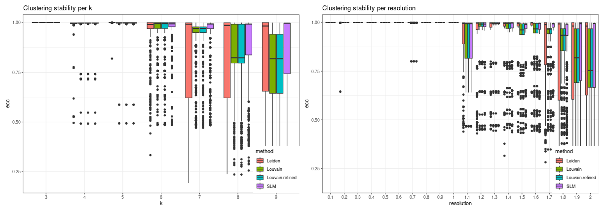

The stats can be further summarised using functions such as the mean or
the median and the overall displayed can be visualised in the following
plot. This utility of this figure is proven on the task of choosing the
clustering method that is overall the most stable. In our case, SLM is
the most stable clustering method.

``` r

wrap_plots(list(
  plot_clustering_overall_stability(clustering_stability, "k") +
      theme(
        legend.position = c(1, 0),
        legend.justification = c(1, 0)
      ),
  plot_clustering_overall_stability(clustering_stability, "resolution", mean) + # function(x) { quantile(x, probs = 0.25)[[1]]})
      theme(
        legend.position = c(1, 0),
        legend.justification = c(1, 0)
      )
), nrow = 1)
```

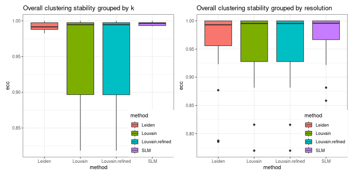

The resulting object can be visualized with `plot_k_resolution_corresp`
as shown in the code below; we showcase the relationship between the
number of clusters and the resolution value. This plot also provides
information on suitable resolution values for predefined number of
clusters. The colour gradient represents either the frequency of the
partitions having *k* clusters or the ECC of them. It can also be used
as proxy to describe the co-variation between (k, resolution). Lighter
(higher) values indicate that little variation is observed, on changes
of the random seed, between the number of clusters and the resolution
value. The size illustrates the frequency of the most common partition
when the resolution and the number of clusters values are fixed.

``` r

plot_k_resolution_corresp(clustering_stability, dodge_width = 0.7, summary_function = min) +
    plot_annotation(title = "resolution - k correspondence with ecs threshold = 1")
```

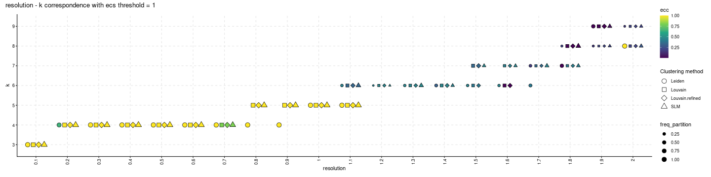

``` r

plot_k_resolution_corresp(clustering_stability, dodge_width = 0.7, colour_information = "freq_k") +
    plot_annotation(title = "resolution - k correspondence with ecs threshold = 1")
```

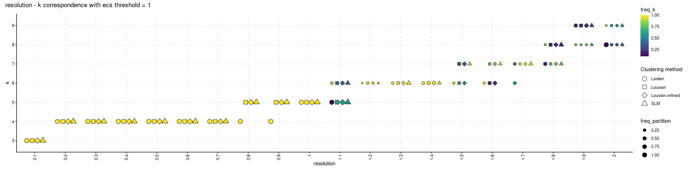

The following plot showcases the co-variation between the stability of
the number of clusters and the number of different partitions resulting
from changes on the seed or the resolution parameter. A high number of
different partitions indicates a lower stability for a given number of
clusters. The colour gradient is proportional to the frequency of most
common partition having a fixed number of clusters or their ECC as an
indicator of robustness. The size indicates the frequency of the
partition having *k* clusters relative to the total number of runs and
should provide additional information whether the behaviour described by
the colour is replicated in multiple instances or not. We note that,
even if we obtain a high number of different partitions, if the
frequency of the most common one is close to 1, then the overall
stability is high. Observing a high number of partitions, each with low
frequency, indicates high instability. For the SLM clustering, k = 3, 4,
5, 6, 7, 8, 9 are stable choices for the number of clusters that should
be used on the downstream analysis.

``` r

plot_k_n_partitions(clustering_stability, dodge_width = 0.5) + plot_annotation(title = "k - # partitions correspondence with ecs threshold = 1")
```

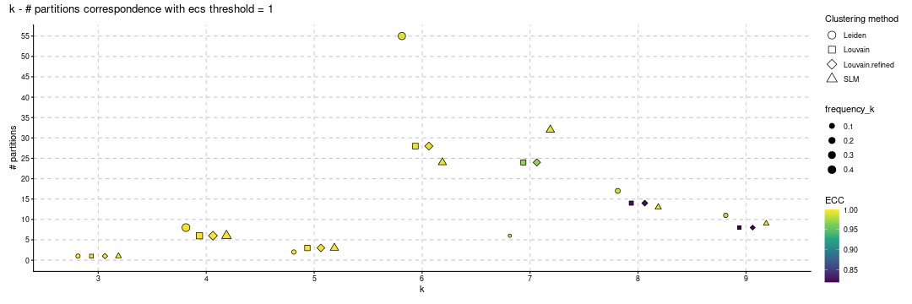

``` r

plot_k_n_partitions(clustering_stability, dodge_width = 0.5, colour_information = "freq_part") + plot_annotation(title = "k - # partitions correspondence with ecs threshold = 1")
```

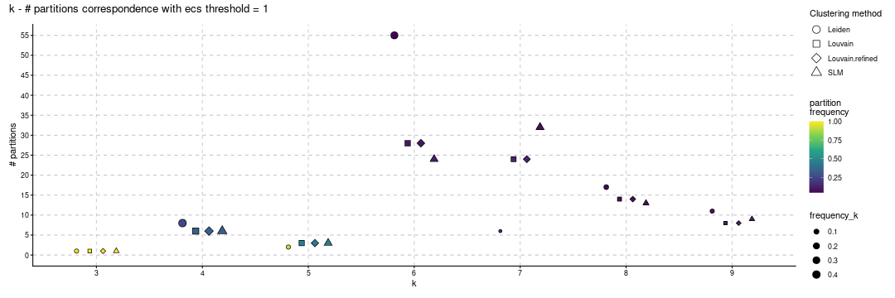

Close the connections opened when using multiple cores.

``` r

foreach::registerDoSEQ()
```

We conclude by summarizing the runtime for executing each step of the
assessment pipeline. The results observed on other systems may vary; the
runtime is also affected by the size of the date (i.e number of cells
and features), the data itself and by actual values for the various
parameters.

``` r

paste(
    "Feature stability methods runtime:",
    format(as.numeric(stop_time_feature_stability - start_time_feature_stability,
        units = "mins"
    )), "minutes"
)
#> [1] "Feature stability methods runtime: 3.406566 minutes"
paste(
    "NN - # connected components methods runtime:",
    format(as.numeric(stop_time_nn_conn - start_time_nn_conn,
        units = "mins"
    )), "minutes"
)
#> [1] "NN - # connected components methods runtime: 0.5474385 minutes"
paste(
    "NN stability methods runtime:",
    format(as.numeric(stop_time_nn_importance - start_time_nn_importance,
        units = "mins"
    )), "minutes"
)
#> [1] "NN stability methods runtime: 2.379103 minutes"
paste(
    "Clustering stability methods runtime:",
    format(as.numeric(stop_time_clustering - start_time_clustering,
        units = "mins"
    )), "minutes"
)
#> [1] "Clustering stability methods runtime: 12.32168 minutes"
```

## Session info

``` r

sessionInfo()
#> R version 4.4.0 (2024-04-24)
#> Platform: x86_64-pc-linux-gnu
#> Running under: Ubuntu 22.04.5 LTS
#> 
#> Matrix products: default
#> BLAS:   /usr/lib/x86_64-linux-gnu/openblas-pthread/libblas.so.3 
#> LAPACK: /usr/lib/x86_64-linux-gnu/openblas-pthread/libopenblasp-r0.3.20.so;  LAPACK version 3.10.0
#> 
#> locale:
#>  [1] LC_CTYPE=C.UTF-8       LC_NUMERIC=C           LC_TIME=C.UTF-8        LC_COLLATE=C.UTF-8     LC_MONETARY=C.UTF-8    LC_MESSAGES=C.UTF-8    LC_PAPER=C.UTF-8       LC_NAME=C              LC_ADDRESS=C           LC_TELEPHONE=C        
#> [11] LC_MEASUREMENT=C.UTF-8 LC_IDENTIFICATION=C   
#> 
#> time zone: Europe/Bucharest
#> tzcode source: system (glibc)
#> 
#> attached base packages:
#> [1] stats     graphics  grDevices utils     datasets  methods   base     
#> 
#> other attached packages:
#>  [1] leiden_0.4.3.1                ClustAssess_1.2.0             ggplot2_4.0.3                 Seurat_5.1.0                  SeuratObject_5.0.2            sp_2.1-4                      Matrix_1.7-0                  patchwork_1.2.0              
#>  [9] pbmcMultiome.SeuratData_0.1.4 pbmc3k.SeuratData_3.1.4       SeuratData_0.2.2.9002         RhpcBLASctl_0.23-42           devtools_2.5.2                usethis_3.2.1                
#> 
#> loaded via a namespace (and not attached):
#>   [1] RColorBrewer_1.1-3     jsonlite_2.0.0         magrittr_2.0.3         ggbeeswarm_0.7.2       spatstat.utils_3.1-2   farver_2.1.2           fs_2.1.0               vctrs_0.6.5            ROCR_1.0-11            memoise_2.0.1         
#>  [11] spatstat.explore_3.2-7 progress_1.2.3         htmltools_0.5.8.1      sctransform_0.4.1      parallelly_1.37.1      KernSmooth_2.23-22     htmlwidgets_1.6.4      ica_1.0-3              plyr_1.8.9             plotly_4.10.4         
#>  [21] zoo_1.8-12             cachem_1.1.0           igraph_2.2.1           iterators_1.0.14       mime_0.12              lifecycle_1.0.5        pkgconfig_2.0.3        R6_2.6.1               fastmap_1.2.0          fitdistrplus_1.1-11   
#>  [31] future_1.33.2          shiny_1.8.1.1          digest_0.6.35          colorspace_2.1-1       tensor_1.5             RSpectra_0.16-2        irlba_2.3.5.1          pkgload_1.5.3          labeling_0.4.3         progressr_0.14.0      
#>  [41] fansi_1.0.6            spatstat.sparse_3.0-3  httr_1.4.7             polyclip_1.10-6        abind_1.4-5            compiler_4.4.0         withr_3.0.3            S7_0.2.1               fastDummies_1.7.3      pkgbuild_1.4.8        
#>  [51] MASS_7.3-60            rappdirs_0.3.3         sessioninfo_1.2.4      tools_4.4.0            vipor_0.4.7            lmtest_0.9-40          otel_0.2.0             beeswarm_0.4.0         httpuv_1.6.15          future.apply_1.11.2   
#>  [61] goftest_1.2-3          glue_1.7.0             nlme_3.1-163           promises_1.3.0         grid_4.4.0             Rtsne_0.17             cluster_2.1.6          reshape2_1.4.4         generics_0.1.3         gtable_0.3.6          
#>  [71] spatstat.data_3.0-4    tidyr_1.3.1            hms_1.1.3              data.table_1.15.4      utf8_1.2.4             BiocGenerics_0.50.0    spatstat.geom_3.2-9    RcppAnnoy_0.0.22       ggrepel_0.9.5          RANN_2.6.1            
#>  [81] foreach_1.5.2          pillar_1.9.0           stringr_1.5.1          spam_2.10-0            RcppHNSW_0.6.0         later_1.3.2            splines_4.4.0          dplyr_1.1.4            lattice_0.22-5         survival_3.5-8        
#>  [91] deldir_2.0-4           tidyselect_1.2.1       miniUI_0.1.2           pbapply_1.7-2          knitr_1.51             gridExtra_2.3          scattermore_1.2        xfun_0.56              SharedObject_1.19.1    matrixStats_1.3.0     
#> [101] stringi_1.8.4          lazyeval_0.2.2         evaluate_1.0.5         codetools_0.2-19       tibble_3.2.1           cli_3.6.6              uwot_0.2.2             xtable_1.8-4           reticulate_1.37.0      Rcpp_1.0.13           
#> [111] globals_0.16.3         spatstat.random_3.2-3  png_0.1-8              ggrastr_1.0.2          parallel_4.4.0         ellipsis_0.3.3         prettyunits_1.2.0      dotCall64_1.1-1        listenv_0.9.1          viridisLite_0.4.2     
#> [121] scales_1.4.0           ggridges_0.5.6         purrr_1.0.2            crayon_1.5.3           rlang_1.3.0            cowplot_1.1.3
```
